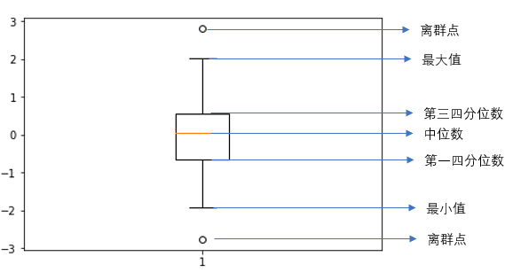

# 简单数据预处理

现实中采集到的统计数据里面往往会有缺失和噪声存在，这是很难避免的。由于大量的数据由人工收集，所以里面也会很多人工录入的错误。同时在收集到的计量数据中很有可能存在如单位不统一的情况，日期的格式也有不同的表达。这时就需要通过数据预处理将原始的数据集经过加工，生成高质量的便于模型计算的数据集。如果将未经过处理的数据直接放入计算模型中去计算，很难的到期望的结果，甚至有可能给出与事实完全相反的结论。数据预处理没有十分标准的做法，对于不同的数据集，需要进行的操作或者步骤都不一样。这就要求在做数据预处理之前需要对所有基本的数据预处理方法有所了解，这样才能面对不同的数据集都能够自如应对。

机器学习使用的数据集一般情况下分为两种，记录数据和图片数据。记录数据一般是表格数据，而图片数据就是一张张图片。本章我主要介绍了各种数据类型以及对记录数据的预处理。
# 记录数据

| 序号   | 姓名   | 成绩   | 年龄   | 身高  |
| :----: | :----: | :----: | :----: | :---: |
| 1      | 张三   | B      | 20     | 175   |
| 2      | 李四   | C      | 21     | 180   |
| 3      | 李磊   | A      | 25     | 172   |
| 4      | 韩梅   | A      | 24     | 163   |

在表格数据中，每一列称作数据的一个 *特征*(feature)，或者 *属性*(Attribute)。每一行称作一条 *记录*(record),或者 *实例*(instance)，或者 *对象*(object)。

每个特征的值可以是数值或者符号。
## 1.1.1 特征类型度量
当拿到一个数据集，在做预处理的时候我们需要把数据分成不同的类别，防止对一些特定的数据做违法的操作。比如对于年份数据，我们不能做加法和乘除法操作，因为这些操作没有意义。
在统计学中，一般情况下我们把数据特征分为4类，**Nominal**、**Ordinal**、**Interval**、**Ratio**，下面将分别说明。

**Nominal**:定义数据，也可称为名义数据，一般指标签或者代号，定义数据是不可计量的。定义数据只提供了可以区别两个记录的信息。如姓名，名称，方位，都是定义数据。

**Ordinal**:定序数据，是有顺序的数据。定序数据提供了可以对记录进行排序的信息。如成绩由好到坏可以分为A、B、C、D。

**Interval**:定距数据，数据没有真正的0点。两个记录特征值的差值是有意义的。如华氏温度，摄氏温度，年龄。

**Ration**:定比数据，有真正0点。两个记录特征值的比率是有意义。比如质量，高度。如身高，体重，开氏温度。

下表说明了不同类型的特征可以进行的操作。

| 操作   | 定义数据 | 定序数据 | 定距数据 | 定比数据 |
| :----: | :----:   | :----:   | :----:   | :----:   |
| 特异性 | √        | √        | √        | √        |
| 排序   | ×        | √        | √        | √        |
| 加减   | ×        | ×        | √        | √        |
| 乘除   | ×        | ×        | ×        | √        |
| 众数   | √        | √        | √        | √        |
| 中位数 | ×        | √        | √        | √        |
| 平均数 | ×        | ×        | √        | √        |
| 方差   | ×        | ×        | √        | √        |


# 1.2 数据清洗
我们现实中收集的原始数据想要不经过处理直接进行训练是不现实的。对于原始数据，我们需要经过预处理的步骤将数据加工为可以进行训练的数据集。首先我们关注的是数据质量问题，在这个方面，我们要检查数据是否有噪声和离群点，每条记录中是否有缺失的特征值，是否有两条记录是重复的等等。
对于离群点，一般情况下我们会尝试修改或者直接移除这条记录。
对于丢失数据，我们首先会想通过其他的数据比如平均值和众数来补充，如果判断该条记录重要性不高，也可以移除。
对于重复数据，一般情况下只保留一个数据并删除其他数据。


*噪声*表明数据在原始值的基础上有随机的变化，一般来源于测量误差。为了降低噪声对模型训练的影响，我们首先可以寻找一些低噪声的数据。其次，可以采用一些降噪方法来降低噪声的干扰。比如采用数据光滑技术来降低噪声。下面介绍一种比较简单的数据光滑技术：分箱。

分箱：分箱通过将数值上临近的数据有序的分到不同的“箱”中，然后对同一个箱中的值进行处理，从而起到光滑数据的作用作用。常用的分箱方法有等频分箱，等宽分箱等。对箱内数据常见的处理方式有取箱中位数、取箱均值、按箱边界等。
- 取箱中位数，就是用箱内所有数值的中位数来取代箱内所有的值。
- 取箱均值，就是用箱内所有数值的中位数来取代箱内所有的值。
- 按箱边界就是将箱内的最大值和最小值作为箱边界，将靠近最小值的数据改为最小值，靠近最大值的数据改为最大值。对于每个箱内的数据量的选取，一般来说数据量越大光滑效果越好。

*离群点*是指某一条记录的特征和其他所有记录都有较大差异，在散点图上表现为离群点和其他大多数记录点的距离都很远。对于离群点，一个简单的产生方式是否有单位错误导致的数量级误差，有的话可以统一单位。对于其他原因都可以删除离群点。离群点的检测技术有很多种，这里简单介绍一种基于统计学方法的参数方法来识别离群点。假设所输入的特征符合正态分布，那么距离均值超过3$\sigma$的就可以视为离群点。还有更多的检测离群点的方法，适用于各种不同的环境，读者可以根据自己的需要来选取合适的方法。


*丢失数据*是指一条记录中的某一条或者某几条特征值缺失。丢失数据主要有两个原因，第一是信息在收录的过程中没有被采集到，例如有些人不愿意在调查表中填写身高和体重的数据。第二是特征可能不适用于该条记录，例如一个调查表中成人可以填写收入，而儿童则没有。
处理丢失数据的方法
- 删除有丢失数据的数据记录(删除行)
- 删除有丢失数据的数据特征(删除列，在这个特征有大量数据缺失的时候)
- 忽略丢失数据
- 尝试填充丢失数据(以平均值，加权平均值等替代)
*重复数据*重复数据包括记录重复或者记录特征重复。记录重复指同一数据集中有两个记录个特征都一样。记录特征重复指在一个数据集中同一个人有两个不同的邮箱，数据集将其视为两个人。重复数据一般是在合并来源不同的数据集的时候产生的。对于重复数据一般取其中一个即可。

# 1.3 数据标准化
在一些机器学习算法中，特征的规模对学习的影响很大，数量级大的特征往往在学习中占据主导地位。而原始数据的量级和量纲通常是不一样的，这会对我们的机器学习算法造成很大的困扰，甚至完全无法正常工作。因此将数据标准化到一个特定的小区间在数据预处理缓解是非常有必要的一件事情。此外，更小的特征值范围也有利于模型迅速收敛。
在机器学习中，数据标准化的方法有很多，这里简单介绍2种。
- 0,1标准化
>$$
x'=\frac{x-{\text{min}}(x)}{{\text{max}}(x)-{\text{min}}(x)}
$$
- Z-score 标准化
>$$
x'=\frac{x-{\text{mean}}(x)}{\sigma}
$$
我们将在实战环节一一介绍每种标准化的实现方法和用途。

# 1.4 独热编码(one-hot encoding)
在机器学习中，我们经常要对类别特征进行处理，这类特征一般而言是离散数据，转换为数值后会被模型认为是连续数据从而对训练有很大的负面作用。例如我们将年级{大一，大二，大三，大四}分别给与{0,1,2,3}的编码，模型就会认为大四的数值比大一大，它的权重就会高，而实际上这他们是完全相等的。为了避免这个问题，我们引入了独热编码。独热编码在数字电路中给与每一个状态一个寄存器，寄存器可以表达0或者1，在同一时间所有表达状态的寄存器只有一个置1，其余全为0。在机器学习中，对于N个类别，我们用N个比特位来表示所有状态。下表将简单的演示独热编码。

|年级|数字编码|独热编码|
|:-:|:-:|:-:|
|大一|0|1000|
|大二|1|0100|
|大三|2|0010|
|大四|3|0001|

# 1.5 实战演练

python中有很多包都可以进行数据清洗的操作，比较基本的方法是使用pandas包进行，这也是我们将主要使用的包。
- pandas 简介
pandas是一个开源的python包，它提供了高效，易用，灵活的数据结构和数据分析方式。pandas本身支持读写多种形式的文件:CSV and text files, Microsoft Excel, SQL databases, and the fast HDF5 format。其内置函数较为完整的包含了数据分析的方方面面，包括数据清洗。

下面我们用一个分析美国2011-2016年H1b签证的例子来说明数据清洗的一般步骤。

首先我们导入数据集。pandas提供了多种形式文件的导入，主要调用的方法是pandas.read_XXX,这里XXX一般是读入文件的后缀名，具体函数和参数可以参考pandas的文档。
``` python
import pandas as pd #习惯性的将pandas缩写为pd
data_h1b=pd.read_csv('h1b_kaggle.csv') #读取.csv文件
data_h1b.head() #显示前几行作为数据预览
```

<table border="1" class="dataframe">
  <thead>
    <tr style="text-align: right;">
      <th></th>
      <th>Unnamed: 0</th>
      <th>CASE_STATUS</th>
      <th>EMPLOYER_NAME</th>
      <th>SOC_NAME</th>
      <th>JOB_TITLE</th>
      <th>FULL_TIME_POSITION</th>
      <th>PREVAILING_WAGE</th>
      <th>YEAR</th>
      <th>WORKSITE</th>
      <th>lon</th>
      <th>lat</th>
    </tr>
  </thead>
  <tbody>
    <tr>
      <th>0</th>
      <td>1</td>
      <td>CERTIFIED-WITHDRAWN</td>
      <td>UNIVERSITY OF MICHIGAN</td>
      <td>BIOCHEMISTS AND BIOPHYSICISTS</td>
      <td>POSTDOCTORAL RESEARCH FELLOW</td>
      <td>N</td>
      <td>36067.0</td>
      <td>2016.0</td>
      <td>ANN ARBOR, MICHIGAN</td>
      <td>-83.743038</td>
      <td>42.280826</td>
    </tr>
    <tr>
      <th>1</th>
      <td>2</td>
      <td>CERTIFIED-WITHDRAWN</td>
      <td>GOODMAN NETWORKS, INC.</td>
      <td>CHIEF EXECUTIVES</td>
      <td>CHIEF OPERATING OFFICER</td>
      <td>Y</td>
      <td>242674.0</td>
      <td>2016.0</td>
      <td>PLANO, TEXAS</td>
      <td>-96.698886</td>
      <td>33.019843</td>
    </tr>
    <tr>
      <th>2</th>
      <td>3</td>
      <td>CERTIFIED-WITHDRAWN</td>
      <td>PORTS AMERICA GROUP, INC.</td>
      <td>CHIEF EXECUTIVES</td>
      <td>CHIEF PROCESS OFFICER</td>
      <td>Y</td>
      <td>193066.0</td>
      <td>2016.0</td>
      <td>JERSEY CITY, NEW JERSEY</td>
      <td>-74.077642</td>
      <td>40.728158</td>
    </tr>
    <tr>
      <th>3</th>
      <td>4</td>
      <td>CERTIFIED-WITHDRAWN</td>
      <td>GATES CORPORATION, A WHOLLY-OWNED SUBSIDIARY O...</td>
      <td>CHIEF EXECUTIVES</td>
      <td>REGIONAL PRESIDEN, AMERICAS</td>
      <td>Y</td>
      <td>220314.0</td>
      <td>2016.0</td>
      <td>DENVER, COLORADO</td>
      <td>-104.990251</td>
      <td>39.739236</td>
    </tr>
    <tr>
      <th>4</th>
      <td>5</td>
      <td>WITHDRAWN</td>
      <td>PEABODY INVESTMENTS CORP.</td>
      <td>CHIEF EXECUTIVES</td>
      <td>PRESIDENT MONGOLIA AND INDIA</td>
      <td>Y</td>
      <td>157518.4</td>
      <td>2016.0</td>
      <td>ST. LOUIS, MISSOURI</td>
      <td>-90.199404</td>
      <td>38.627003</td>
    </tr>
  </tbody>
</table>

我们可以发现数据已经读入，并存储在变量data_h1b中。pandas的表格第一列是固定的序号列，没有列名称，第二列开始每一列是一个特征，从读入的数据中产生。

丢失数据

我们用一个简单的数据集来说明如何处理丢失数据
| 序号   | 姓名   | 成绩   | 年龄   | 身高  |
| :----: | :----: | :----: | :----: | :---: |
| 1      | 张三   | B      | 20     | 175   |
| 2      | 李四   | C      | 21     |    |
| 3      | 李磊   | A      | 25     |   |
| 4      | 韩梅   | A      |      |    |

# 缺失数据删除


```python
frame=pd.DataFrame({'序号':[1,2,3,4],'姓名':['张三','李四','李磊','韩梅'],'成绩':['B','C','A','A'],'年龄':[20,21,25,None],'身高':[175,None,None,None]})
```

使用isnull()函数可以直观的看到每一项是否有缺失，不过如果数据量太大，我们很难找到哪些数据有缺失。


```python
frame.isnull()
```
<table border="1" class="dataframe">
  <thead>
    <tr style="text-align: right;">
      <th></th>
      <th>序号</th>
      <th>姓名</th>
      <th>成绩</th>
      <th>年龄</th>
      <th>身高</th>
    </tr>
  </thead>
  <tbody>
    <tr>
      <th>0</th>
      <td>False</td>
      <td>False</td>
      <td>False</td>
      <td>False</td>
      <td>False</td>
    </tr>
    <tr>
      <th>1</th>
      <td>False</td>
      <td>False</td>
      <td>False</td>
      <td>False</td>
      <td>True</td>
    </tr>
    <tr>
      <th>2</th>
      <td>False</td>
      <td>False</td>
      <td>False</td>
      <td>False</td>
      <td>True</td>
    </tr>
    <tr>
      <th>3</th>
      <td>False</td>
      <td>False</td>
      <td>False</td>
      <td>True</td>
      <td>True</td>
    </tr>
  </tbody>
</table>


在这个假设的数据集中我们要怎么操作呢？首先我我们可以统计每个特征或者每条记录缺失数据的分布情况。


```python
print(frame.isnull().sum(axis=0)) #纵向统计有多少缺失数据
print(frame.isnull().sum(axis=1)) #横向统计有多少缺失数据
```

    序号    0
    姓名    0
    成绩    0
    年龄    1
    身高    3
    dtype: int64
    0    0
    1    1
    2    1
    3    2
    dtype: int64
    


```python
frame 
```

    序号  姓名 成绩    年龄     身高
    0   1  张三  B  20.0  175.0
    1   2  李四  C  21.0    NaN
    2   3  李磊  A  25.0    NaN
    3   4  韩梅  A   NaN    NaN
    

从获取的信息中可以看出，在年龄这个特征中有1个缺失数据，在身高特征有3个缺失数据。在第2，3条记录分别有一个缺失数据，第4条有两个缺失数据。我们可以简单的删除这些有缺失数据的项，操作及结果如下。


```python
frame_dropall=frame.dropna() #删除所有有缺失数据的记录
frame
```

    序号  姓名 成绩    年龄     身高
    0   1  张三  B  20.0  175.0
    

可以看到dropna函数把所有的含有缺失数据的记录都删除了。不过很可能经过缺失数据删除后的数据集规模太小而无法使用，在这种情况下我们可以通过对缺失数据填补和删除特征来保持数据集规模。

首先是年龄特征，我们经过对表的简单分析，可以看出这是一个学生成绩的表，所以学生的年龄应该差不多，我们可以用平均值来填补。


```python
frame2=frame.fillna({'年龄':frame['年龄'].mean()}) #填充年龄的平均值
```

fillna函数中的值可以是字典，它可以对某一列或者某几列的缺失数据进行操作。


```python
frame2
```


<table border="1" class="dataframe">
  <thead>
    <tr style="text-align: right;">
      <th></th>
      <th>序号</th>
      <th>姓名</th>
      <th>成绩</th>
      <th>年龄</th>
      <th>身高</th>
    </tr>
  </thead>
  <tbody>
    <tr>
      <th>0</th>
      <td>1</td>
      <td>张三</td>
      <td>B</td>
      <td>20.0</td>
      <td>175.0</td>
    </tr>
    <tr>
      <th>1</th>
      <td>2</td>
      <td>李四</td>
      <td>C</td>
      <td>21.0</td>
      <td>NaN</td>
    </tr>
    <tr>
      <th>2</th>
      <td>3</td>
      <td>李磊</td>
      <td>A</td>
      <td>25.0</td>
      <td>NaN</td>
    </tr>
    <tr>
      <th>3</th>
      <td>4</td>
      <td>韩梅</td>
      <td>A</td>
      <td>22.0</td>
      <td>NaN</td>
    </tr>
  </tbody>
</table>


这里我们就把年龄的缺失数据填上了，那么对于身高呢？经过观察可以发现，身高的缺失数据非常多，占到所有数据的75%。我们当然可以按照平均值来填补数据，但是会造成身高这一项失去特征表达的作用，因为所有项目都一样，因此我们可以删除这一列。


```python
frame2.dropna(axis=1)  #按照列删除缺失数据，这里参数axis表达删除的方向，0表示按行删除，1表示按列删除。删除的是有缺失数据的一整行或列。
```


<table border="1" class="dataframe">
  <thead>
    <tr style="text-align: right;">
      <th></th>
      <th>序号</th>
      <th>姓名</th>
      <th>成绩</th>
      <th>年龄</th>
    </tr>
  </thead>
  <tbody>
    <tr>
      <th>0</th>
      <td>1</td>
      <td>张三</td>
      <td>B</td>
      <td>20.0</td>
    </tr>
    <tr>
      <th>1</th>
      <td>2</td>
      <td>李四</td>
      <td>C</td>
      <td>21.0</td>
    </tr>
    <tr>
      <th>2</th>
      <td>3</td>
      <td>李磊</td>
      <td>A</td>
      <td>25.0</td>
    </tr>
    <tr>
      <th>3</th>
      <td>4</td>
      <td>韩梅</td>
      <td>A</td>
      <td>22.0</td>
    </tr>
  </tbody>
</table>


下面列出之前使用的dropna和fillna的所有用法。

DataFrame.dropna(axis=0, how='any', thresh=None, subset=None, inplace=False)

### dropna

| 参数 | 用法|
| :- | :- |
|axis|控制移除缺失数据的行或者列。有两个参数{0 或者 'index',1 或者 'columns'}，如果输入是0或者'index'则移除缺失数据的行（记录），如果输入是1或者'columns'就移除有缺失数据的列。默认是0。|
|how|决定空缺数据移除出数据集的方式。有两个参数{'any','all'},如果输入是'any'只要这一行（列）有缺失数据，就移除这一行（列）。如果输入是'all'则只有在这一行（列）数据全部缺失后才移除。
|tresh|控制每行（列）留下的非缺失数据个数。输入一个int型整数。
|subset|控制从哪一行（列）寻找缺失数据。输入一个列表。如果想删除有缺失数据的行，就读入特征名作为列表里的值。
|inplace|控制操作是直接作用在数据集上还是副本上。有两个参数{True，False},如果输入是True则在原始数据集上直接操作，返回None。如果是False则在生成的副本上操作，返回操作完成的副本。

下面对之前没有提到的操作进行举例说明，方便理解。


```python
frame_thr=frame.dropna(thresh=4) #控制有效值超过4个的数据记录保留
print(frame_thr)
```

       序号  姓名 成绩    年龄     身高
    0   1  张三  B  20.0  175.0
    1   2  李四  C  21.0    NaN
    2   3  李磊  A  25.0    NaN
    


```python
frame_sub=frame.dropna(subset=['年龄']) #加入subset参数表示只观察年龄特征的参数，而不管其他特征是否有缺失数据
print(frame_sub)
```

       序号  姓名 成绩    年龄     身高
    0   1  张三  B  20.0  175.0
    1   2  李四  C  21.0    NaN
    2   3  李磊  A  25.0    NaN
    


```python
frame_in=frame.dropna(inplace=True) #可以看到inplace为True时函数直接在原始数据集上进行了操作，返回值是None
print(frame)
print(frame_in)
```

       序号  姓名 成绩    年龄     身高
    0   1  张三  B  20.0  175.0
    None
    

### fillna
DataFrame.fillna(value=None, method=None, axis=None, inplace=False, limit=None, downcast=None, **kwargs)

|参数|用法|
|:--:|:--:|
|value|需要填补的数据。允许读入的数据类型有标量数据、字典、序列和数据集。字典，序列和数据集可以指定需要填充数据的标签|
|method|可以控制填充的方式。有5个参数{'backfill','bfill','pad','ffill',None},默认为None。
backfill/bfill:用下一个非缺失数据区填充该数据，pad/fill:用前一个非缺失数据去填充该数据。None表示用制定的数据填充该缺失数据。
|axis|控制操作方向。有两个参数{0 或者 'index',1 或者 'columns'}，默认为0。输入0表示按照行操作，1表示按照列操作。
|implace|控制操作是直接作用在数据集上还是副本上。有两个参数{True，False},如果输入是True则在原始数据集上直接操作，返回None。如果是False则在生成的副本上操作，返回操作完成的副本。
|limit| 控制沿轴填充缺失数据的最大个数。输入一个int型整数，默认为None。
|downcast| 控制是否进行类型转换。输入一个字典{'对象':'数据类型'}。


# 重复数据处理


```python
frame=pd.DataFrame({'序号':[1,2,3,4,1],'姓名':['张三','李四','李磊','韩梅','张三'],'成绩':['B','C','A','A','B'],'年龄':[20,21,25,None,20],'身高':[175,None,None,None,175]})
```

在原始数据集的基础上，增加一列新的数据，来讲解如何使用pandas包来处理重复数据。


```python
print(frame)
```

       序号  姓名 成绩    年龄     身高
    0   1  张三  B    20  175.0
    1   2  李四  C    21    NaN
    2   3  李磊  A    25    NaN
    3   4  韩梅  A  None    NaN
    4   1  张三  B    20  175.0
    


```python
print(frame.duplicated()) #查看是否有重复记录，只有所有特征都一样时判断为相同。
```

    0    False
    1    False
    2    False
    3    False
    4     True
    dtype: bool
    


```python
print(frame.drop_duplicates()) #删除重复记录，默认保存第一个
```

       序号  姓名 成绩    年龄     身高
    0   1  张三  B  20.0  175.0
    1   2  李四  C  21.0    NaN
    2   3  李磊  A  25.0    NaN
    3   4  韩梅  A   NaN    NaN
    

下面给出duplicated()和drop_duplicateds()的全部参数定义

### duplicated()
DataFrame.duplicated(subset=None, keep='first')

|参数|用法|
|:-:|:-:|
|subset|控制选择特定的特征判断重复。读入一个或一个序列的特征标签名。
|keep|判断重复的记录的位置。有三个参数{'first','last',False},默认为first。如果输入为'first'，则除了第一出现的记录以外的其他记录都标记为重复（True）。如果输入为'last'则除了最后一个出现的记录以外的其他记录都标记为重复（True）。如果输入为False，则所有重复记录都标记为True。


```python
l=['序号','姓名']
```


```python
l
```


    ['序号', '姓名']


```python
print(frame.duplicated(subset=l)) #记录仅有序号和姓名重复的记录
```

    0    False
    1    False
    2    False
    3    False
    4     True
    dtype: bool
    


```python
print(frame.duplicated(keep='last'))
```

    0     True
    1    False
    2    False
    3    False
    4    False
    dtype: bool
    

### drop_duplicated()
DataFrame.drop_duplicates(subset=None, keep='first', inplace=False)

|参数|用法|
|:-:|:-:|
|subset| 控制选择特定的特征判断重复。读入一个或一个序列的特征标签名。
|keep| 判断重复的记录的位置。有三个参数{'first','last',False},默认为first。如果输入为'first'，则删除除了第一出现的记录以外的其他记录。如果输入为'last'则删除除了最后一个出现的记录以外的其他记录。如果输入为False，则删除所有重复记录。
|inplace|控制操作是直接作用在数据集上还是副本上。有两个参数{True，False},如果输入是True则在原始数据集上直接操作，返回None。如果是False则在生成的副本上操作，返回操作完成的副本。


# 离群值处理

离群值检测的方法有很多，下面介绍两种。

1、3$\sigma$
- 如可以假设一元数据服从正态分布， $\mu$为正态均值，$\sigma$为正态标准差，则在($\mu$-3$\sigma$,$\mu$+3$\sigma$)的区间内包含99.97%的值。我们将距离均值超过3$\sigma$的数据点都当做离群值处理。

2、箱图
- 我们还可以用一种叫做箱图的方法来检测离群值的方法。箱图是一种比较流行的观察离群值的方法，它可以直观的展示出数据的最大非离群点值，最小非离群点值，中位数，和第一、第三四分位数。其中第一四分位数可以用Q1表示,第三四分位数可以用Q3表示。中间四分位数极差用IQR表示，定义为Q3-Q1。最大非离群点值为小于Q3+1.5×IQR的最大值，最小非离群点为大于Q1-1.5×IQR的最小值。在(Q1-1.5×IQR,Q3+1.5×IQR)的区间内包含了99.3%的值，我们可以将区间之外的值当做是离群点。下图展示了一个简单的箱图说明。




下面我们会使用一个简单的例子来说明如何观察箱图和如何在python中制作箱图，并用箱图来排除离群点。

首先我们可以生成100个随机数，再调用matplotlib 中绘制箱图的函数就可以轻松的绘制出简单的箱图。


```python
import matplotlib.pyplot as plt
import numpy as np
```


```python
rand_data=np.random.randn(100) #生成100个随机数
plt.boxplot(rand_data) #产生图片
plt.show() #输出图片
```


```python
import matplotlib.pyplot as plt
import numpy as np
#生成100个随机数
rand_data=np.random.randn(100) 
#产生图片
plt.boxplot(rand_data) 
#输出图片
plt.show() 
```


我们绘制出了箱图，从图中可以看出有两个离群值，所以我们需要对这两个离群值进行处理。对离群值我们可以把他们当做缺失值，根据具体情况用均值、最接近值等来填补。这里我们直接删除这条数据。下面是离群值筛选代码。


```python
import matplotlib.pyplot as plt
import numpy as np
rand_data=np.random.randn(100) #生成100个随机数
#取第一四分位点Q1
Q1 = np.percentile(rand_data, 25)
#取第3四分位点Q3
Q3 = np.percentile(rand_data, 75)
#计算中间四分位数极差IQR
IQR = Q3-Q1
#使用布尔值索引，得到所有离群值数据
data_OutLier = rand_data[(rand_data<Q1-1.5*IQR)|(rand_data>Q3+1.5*IQR)]
#室友布尔值索引，得到所有有效值数据
data_Processed =rand_data[(rand_data>Q1-1.5*IQR)&(rand_data<Q3+1.5*IQR)]

#输出数据检测长度是否正确
print('随机数据长度:',len(rand_data))
print('离群值长度:',len(data_OutLier))
print('有效值长度:',len(data_Processed))
```

    离群值长度: 2
    有效值长度: 98
    随机数据长度: 100
    

# 噪声处理

这里我们介绍对噪声进行分箱处理的方法。分箱在前面章节中介绍过2种分箱方法：等频，等宽。3种对箱内数据处理的方法：分别是取箱中位数、取箱中位数和按箱边界。下面的代码部分将分别展示各种分箱方法和箱内数据处理方法。代码实现比较基础，有改进空间，读者可以自行探索。

- 等频分箱
等频分箱是将数据按一定顺序排序后，每个箱中放入数量相等的数据。


```python
import numpy as np
np.random.seed(8)
#首先生成30个随机整数
rand_Noise=np.random.randint(15, size =30 ) 
print('原始随机数据:',rand_Noise)
#对数据进行排序
rand_NoiseSorted=np.sort(rand_Noise)
print('排序数据:',rand_NoiseSorted)
#假设分5个箱，可以用numpy自带的切片操作来进行等频分箱
box_list=[]
for i in range(5):
    #data[x:y]的索引代表着在data在[x,y)的索引区间内的值
    #如data[0,6]代表着data[0]到data[5]总共6个值
    box_list.append(rand_NoiseSorted[6*i:6*i+6])
#打印所有分箱情况
for i in range(5):
    print('箱%d:'%(i+1),box_list[i])
```

    原始随机数据: [ 3  4  1  9  5 10  8  3  8  0 13  5 12  1  3 10 11 12 13  9 13 13  2 11
      2 14  6 13  8  9]
    排序数据: [ 0  1  1  2  2  3  3  3  4  5  5  6  8  8  8  9  9  9 10 10 11 11 12 12
     13 13 13 13 13 14]
    箱1: [0 1 1 2 2 3]
    箱2: [3 3 4 5 5 6]
    箱3: [8 8 8 9 9 9]
    箱4: [10 10 11 11 12 12]
    箱5: [13 13 13 13 13 14]
    

- 等宽分箱
等宽分箱是将变量的取值范围分成等宽的区间，每个区间视为一个分箱。


```python
import numpy as np
import pandas as pd
#设置分箱个数
cut=5
#使用pandas 的cut 功能进行分箱，cut数是所分箱的个数，返回一个pandas.categorical类型的指
colBin = pd.cut(rand_Noise,cut)
#初始化分箱，每个分箱由一个列表存储
box_list=[]
for i in range(cut):
    box_list.append([])
#按分好的categorical把数据放入箱中
for i,j in zip(rand_Noise,colBin.codes):
    box_list[j].append(i)
#打印所有分箱情况
for i in range (len(box_list)):
    print ('箱%d:'%(i+1),box_list[i])
```

    箱1: [1, 0, 1, 2, 2]
    箱2: [3, 4, 5, 3, 5, 3]
    箱3: [8, 8, 6, 8]
    箱4: [9, 10, 10, 11, 9, 11, 9]
    箱5: [13, 12, 12, 13, 13, 13, 14, 13]
    

上面介绍了等频和等宽的分箱方法，使用pandas和numpy库就可以十分轻松的实现。下面以等宽分箱的数据为例介绍如何光滑箱内数据。

- 箱中位数


```python
from copy import deepcopy
```


```python
#数据展示
print('原始数据：')
for i in range (len(box_list)):
    print ('箱%d:'%(i+1),box_list[i])
#初始化箱
box_MedianSmooth=[]
#对每个箱进行遍历
for i in range(len(box_list)):
    #新建一个箱
    box_MedianSmooth.append([])
    #算出中位数
    mid = np.median(box_list[i])
    #将箱内每个数以中位数替换
    for j in range(len(box_list[i])):
        #使用浮点型防止有数组个数为偶数时可能造成的误差
        box_MedianSmooth[i].append(mid)
print('光滑后数据')
for i in range (len(box_list)):
    print ('箱%d:'%(i+1),box_MedianSmooth[i])
```

    原始数据：
    箱1: [0 1 1 2 2 3]
    箱2: [3 3 4 5 5 6]
    箱3: [8 8 8 9 9 9]
    箱4: [10 10 11 11 12 12]
    箱5: [13 13 13 13 13 14]
    光滑后数据
    箱1: [1.5, 1.5, 1.5, 1.5, 1.5, 1.5]
    箱2: [4.5, 4.5, 4.5, 4.5, 4.5, 4.5]
    箱3: [8.5, 8.5, 8.5, 8.5, 8.5, 8.5]
    箱4: [11.0, 11.0, 11.0, 11.0, 11.0, 11.0]
    箱5: [13.0, 13.0, 13.0, 13.0, 13.0, 13.0]
    

- 箱平均数

箱平均数与箱中位数同理，只需要将求中位数的函数换为求平均数的函数即可。numpy中求平均数的函数为numpy.mean()。

- 箱边界

箱边界需要对箱内数据和箱边界的距离进行判断，将数据光滑为更接近的那个边界，代码如下。


```python
#数据展示
print('原始数据：')
for i in range (len(box_list)):
    print ('箱%d:'%(i+1),box_list[i])
#初始化箱
box_EdgeSmooth=[]
for i in range(len(box_list)):
    #新建一个箱
    box_EdgeSmooth.append([])
    boxMax=np.max(box_list[i])
    boxMin=np.min(box_list[i])
    for j in range(len(box_list[i])):
        if (box_list[i][j]-boxMin)>(boxMax-box_list[i][j]):
            box_EdgeSmooth[i].append(boxMax)
        else:
            box_EdgeSmooth[i].append(boxMin)
print('光滑后数据')
for i in range (len(box_list)):
    print ('箱%d:'%(i+1),box_EdgeSmooth[i])
```

    原始数据：
    箱1: [0 1 1 2 2 3]
    箱2: [3 3 4 5 5 6]
    箱3: [8 8 8 9 9 9]
    箱4: [10 10 11 11 12 12]
    箱5: [13 13 13 13 13 14]
    光滑后数据
    箱1: [0, 0, 0, 3, 3, 3]
    箱2: [3, 3, 3, 6, 6, 6]
    箱3: [8, 8, 8, 9, 9, 9]
    箱4: [10, 10, 10, 10, 12, 12]
    箱5: [13, 13, 13, 13, 13, 14]
    

# 数据标准化

在这节内我们可以调用sklearn库来快速的进行标准化处理。

- 比例调节
>$$
x'=\frac{x-{\text{min}}(x)}{{\text{max}}(x)-{\text{min}}(x)}
$$
- Z-score 标准化
>$$
x'=\frac{x-{\text{mean}}(x)}{\sigma}
$$


- 0,1标准化又称离差标准化,作用是将数据集内的所有数据缩放到[0,1]的范围之内。
- Z-Score标准化，作用是将数据集转化为均值为0，标准差为1的标准正态分布数据。但如果原始数据和标准正态分布相差很远，那么结果可能会非常糟糕。

代码如下。

0-1标准化


```python
from sklearn import preprocessing
data_Standardization=np.random.randint(50,size=(5,5))
#使用预处理中的MinMaxScaler生成一个标准化对象
min_max_scaler = preprocessing.MinMaxScaler()
#调用这个对象对数据进行标准化操作
data_scaled = min_max_scaler.fit_transform(data_Standardization)
print('原始数据：')
print(data_Standardization)
print('0-1标准化后数据')
print(data_scaled)
```

    原始数据：
    [[ 7 45 19 40 40]
     [46 34 38  5 10]
     [39 22 22  9 27]
     [40 49  2 26 30]
     [ 2 11  7  1 24]]
    0-1标准化后数据
    [[0.11363636 0.89473684 0.47222222 1.         1.        ]
     [1.         0.60526316 1.         0.1025641  0.        ]
     [0.84090909 0.28947368 0.55555556 0.20512821 0.56666667]
     [0.86363636 1.         0.         0.64102564 0.66666667]
     [0.         0.         0.13888889 0.         0.46666667]]
    

Z-score标准化


```python
from sklearn import preprocessing
data_scaled = preprocessing.scale(data_Standardization)
print('原始数据：')
print(data_Standardization)
print('Z-score标准化后数据')
print(data_scaled)
print('特征均值')
print(data_scaled.mean(axis=0))
print('特征方差')
print(data_scaled.std(axis=0))
```

    原始数据：
    [[ 7 45 19 40 40]
     [46 34 38  5 10]
     [39 22 22  9 27]
     [40 49  2 26 30]
     [ 2 11  7  1 24]]
    Z-score标准化后数据
    [[-1.07418496  0.9038322   0.11115313  1.62632665  1.41914037]
     [ 1.0416339   0.1271014   1.61965985 -0.76533019 -1.66594739]
     [ 0.66187154 -0.72024128  0.3493384  -0.49199798  0.08226901]
     [ 0.7161233   1.18627976 -1.23856342  0.66966391  0.39077778]
     [-1.34544378 -1.49697208 -0.84158796 -1.0386624  -0.22623977]]
    特征均值
    [-4.44089210e-17 -1.77635684e-16 -1.55431223e-16  4.44089210e-17
      7.21644966e-17]
    特征方差
    [1. 1. 1. 1. 1.]
    
    

可以看到均值非常接近0，方差为1

这里需要注意的是，如果输入矩阵，sklearn的预处理操作默认是对列进行的，这也刚好是我们需要的——我们通常是对特征进行标准化处理，而每个特征在数据集中的表现就是列。
