## 2. 探索数据与可视化

在上一章中，我们学习了如何对手上的原始数据进行预处理。通过对数据的预处理，我们可以将原始数据处理成为数据分析乃至构建模型的理想数据形式。数据预处理的过程本身较为枯燥，然而却是机器学习当中极其重要的组成部分。任何模型都需要数据的支持，如果有好的试验数据作为支撑，我们往往能够获得事半功倍的效果。

经过了对数据的清洗过程，我们获得了比较理想的用于试验的数据。这些数据常见的可以包括csv文件（逗号分隔符文件），图像文件，txt文件（文本文件）等。如果我们想更深入的了解这些数据的分布等特征，数据可视化就能够帮助我们。我们可以使用作图的形式，看看数据可以告诉我们什么，从而合理选择和使用数据特征。

针对探索数据与可视化这个概念，在不同的领域会有些许的不同。在数据挖掘的领域，我们会更强调对数据的汇总以及可视化的展示，因为数据挖掘将描述性数据分析技术本身看作目的。数据的可视化有时甚至可以通过对数据进行直观地检查来发现解决一些现实课题地办法。而在机器学习领域，由于我们是以建造解决问题地模型为目的，所以对数据的探索以及可视化的展现所起到的作用是用来辅助我们建立合适的模型。所以我们在本章将侧重讲解通常的探索数据与可视化的方法。

### 2.1 数据汇总

数据汇总主要实现对数据的量化，因为我们有大量问题的数据是通过csv等文件形式存在的，因此需要对数据进行汇总来观察数据的各项指标。由于数据汇总涉及到的数学概念都是统计学的基本概念，因此这里我们将用泰坦尼克（Titanic）数据集作为讲解的例子直接进行介绍，如有疑惑可以首先去了解统计学的基础知识。这个数据集是公开可用的，同时它也是Kaggle竞赛的一部分。

我们可以从https://www.kaggle.com/c/titanic-gettingStarted 获取该数据集。

首先让我们读取titanic.csv文件，然后浏览前5行数据来做一个简单了解。


```python
import pandas as pd
import numpy as np

print('Pandas:', pd.__version__)
print('Numpy:',np.__version__)

df = pd.read_csv('titanic.csv')

df.head()
```

    Pandas: 0.23.1
    Numpy: 1.12.1


<table border="1" class="dataframe">
  <thead>
    <tr style="text-align: right;">
      <th></th>
      <th>PassengerId</th>
      <th>Survived</th>
      <th>Pclass</th>
      <th>Name</th>
      <th>Sex</th>
      <th>Age</th>
      <th>SibSp</th>
      <th>Parch</th>
      <th>Ticket</th>
      <th>Fare</th>
      <th>Cabin</th>
      <th>Embarked</th>
    </tr>
  </thead>
  <tbody>
    <tr>
      <th>0</th>
      <td>1</td>
      <td>0</td>
      <td>3</td>
      <td>Braund, Mr. Owen Harris</td>
      <td>male</td>
      <td>22.0</td>
      <td>1</td>
      <td>0</td>
      <td>A/5 21171</td>
      <td>7.2500</td>
      <td>NaN</td>
      <td>S</td>
    </tr>
    <tr>
      <th>1</th>
      <td>2</td>
      <td>1</td>
      <td>1</td>
      <td>Cumings, Mrs. John Bradley (Florence Briggs Th...</td>
      <td>female</td>
      <td>38.0</td>
      <td>1</td>
      <td>0</td>
      <td>PC 17599</td>
      <td>71.2833</td>
      <td>C85</td>
      <td>C</td>
    </tr>
    <tr>
      <th>2</th>
      <td>3</td>
      <td>1</td>
      <td>3</td>
      <td>Heikkinen, Miss. Laina</td>
      <td>female</td>
      <td>26.0</td>
      <td>0</td>
      <td>0</td>
      <td>STON/O2. 3101282</td>
      <td>7.9250</td>
      <td>NaN</td>
      <td>S</td>
    </tr>
    <tr>
      <th>3</th>
      <td>4</td>
      <td>1</td>
      <td>1</td>
      <td>Futrelle, Mrs. Jacques Heath (Lily May Peel)</td>
      <td>female</td>
      <td>35.0</td>
      <td>1</td>
      <td>0</td>
      <td>113803</td>
      <td>53.1000</td>
      <td>C123</td>
      <td>S</td>
    </tr>
    <tr>
      <th>4</th>
      <td>5</td>
      <td>0</td>
      <td>3</td>
      <td>Allen, Mr. William Henry</td>
      <td>male</td>
      <td>35.0</td>
      <td>0</td>
      <td>0</td>
      <td>373450</td>
      <td>8.0500</td>
      <td>NaN</td>
      <td>S</td>
    </tr>
  </tbody>
</table>
</div>


其中的各列为：

+ PassengerId —— 乘客编号
+ Survived —— 幸存情况：0（死亡），1（生存）
+ Pclass —— 船票级别由高到低： 1， 2， 3
+ name —— 乘客名称
+ Sex —— 性别：male（男性），female（女性）
+ Age —— 年龄
+ SibSp —— 在船上的兄弟姐妹/配偶的人数
+ Parch —— 在船上的父母/子女的人数
+ Ticket —— 船票编号
+ Fare —— 乘客票价
+ Cabin —— 所在船舱具体位置
+ Embarked: 登船港口（C = Cherbourg; Q = Queenstown; S = Southampton）


接下来我们可以看看泰坦尼克数据集的数据汇总。


```python
df.describe()
```


<table border="1" class="dataframe">
  <thead>
    <tr style="text-align: right;">
      <th></th>
      <th>PassengerId</th>
      <th>Survived</th>
      <th>Pclass</th>
      <th>Age</th>
      <th>SibSp</th>
      <th>Parch</th>
      <th>Fare</th>
    </tr>
  </thead>
  <tbody>
    <tr>
      <th>count</th>
      <td>891.000000</td>
      <td>891.000000</td>
      <td>891.000000</td>
      <td>714.000000</td>
      <td>891.000000</td>
      <td>891.000000</td>
      <td>891.000000</td>
    </tr>
    <tr>
      <th>mean</th>
      <td>446.000000</td>
      <td>0.383838</td>
      <td>2.308642</td>
      <td>29.699118</td>
      <td>0.523008</td>
      <td>0.381594</td>
      <td>32.204208</td>
    </tr>
    <tr>
      <th>std</th>
      <td>257.353842</td>
      <td>0.486592</td>
      <td>0.836071</td>
      <td>14.526497</td>
      <td>1.102743</td>
      <td>0.806057</td>
      <td>49.693429</td>
    </tr>
    <tr>
      <th>min</th>
      <td>1.000000</td>
      <td>0.000000</td>
      <td>1.000000</td>
      <td>0.420000</td>
      <td>0.000000</td>
      <td>0.000000</td>
      <td>0.000000</td>
    </tr>
    <tr>
      <th>25%</th>
      <td>223.500000</td>
      <td>0.000000</td>
      <td>2.000000</td>
      <td>20.125000</td>
      <td>0.000000</td>
      <td>0.000000</td>
      <td>7.910400</td>
    </tr>
    <tr>
      <th>50%</th>
      <td>446.000000</td>
      <td>0.000000</td>
      <td>3.000000</td>
      <td>28.000000</td>
      <td>0.000000</td>
      <td>0.000000</td>
      <td>14.454200</td>
    </tr>
    <tr>
      <th>75%</th>
      <td>668.500000</td>
      <td>1.000000</td>
      <td>3.000000</td>
      <td>38.000000</td>
      <td>1.000000</td>
      <td>0.000000</td>
      <td>31.000000</td>
    </tr>
    <tr>
      <th>max</th>
      <td>891.000000</td>
      <td>1.000000</td>
      <td>3.000000</td>
      <td>80.000000</td>
      <td>8.000000</td>
      <td>6.000000</td>
      <td>512.329200</td>
    </tr>
  </tbody>
</table>
</div>


这里我们可以发现Pandas库对数据汇总有很好的支持。数据的汇总统计了数量，平均数，标准差，最小值，百分之二十五点，百分之五十点，百分之七十五点和最大值。接下来我们再看看数据的格式汇总。数据的平均值体现了数据的位置，但是它对异常值比较敏感。标准差体现了数据的集中度，极差作为最大值和最小值之间的差值也是来获得数据范围的参考。剩余各点的数据值则体现了数据的大体分布，这也是箱图（Box plot）所需的基础数据，后面我们将对箱图做相应介绍。


```python
print(df.info())
```

    <class 'pandas.core.frame.DataFrame'>
    RangeIndex: 891 entries, 0 to 890
    Data columns (total 12 columns):
    PassengerId    891 non-null int64
    Survived       891 non-null int64
    Pclass         891 non-null int64
    Name           891 non-null object
    Sex            891 non-null object
    Age            714 non-null float64
    SibSp          891 non-null int64
    Parch          891 non-null int64
    Ticket         891 non-null object
    Fare           891 non-null float64
    Cabin          204 non-null object
    Embarked       889 non-null object
    dtypes: float64(2), int64(5), object(5)
    memory usage: 83.6+ KB
    None


这里可以看到每个维度的数据格式以及各维度的非空数据量。从这里我们可以得知泰坦尼克数据集是有缺失的，在未来的建立模型的过程中，可能需要我们进行一些处理。

### 2.2 数据可视化

可视化是将数据转换为可视的格式，以便可以分析或报告数据的特征以及数据项或属性之间的关系。人类具有良好的视觉分析能力，因此面对所呈现的大量信息，我们可以探查出数据的一般模式和趋势，也可以检测异常值和异常特征。

这里我们来看一个经典的例子。下图是1982年7月的海面温度（SST）的图片，在这个图中总结了数万个温度数据点。从这张图中我们可以清楚地看出温度分布，在赤道附近海洋温度最高，在两极区域海洋温度最低。

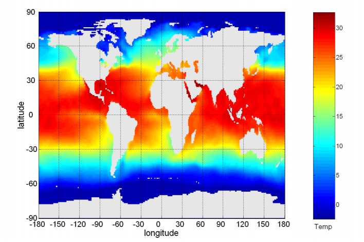

数据的可视化又很多种作图方法，我们可以将数据对象以及数据属性之间的关系转换为图形元素，如点，线，形状和颜色。下面我们将通常使用的作图方法进行一一介绍。

### 2.2.1 常见图表

#### 直方图

直方图（Histogram）通常用来显示单个变量的值的分布。它将值分到每个条行柱中，显示出物体数量的条形图，每个条形的高度表示对象的数量。这里我们用经典的Iris花瓣数据集作为示例图。

示例：花瓣宽度和花瓣长度

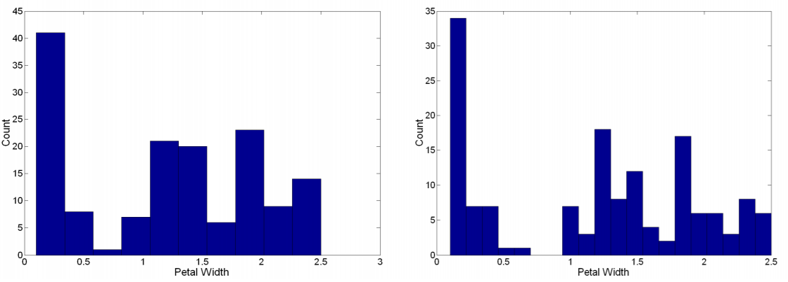

二维直方图能够显示两个属性值的联合分布

示例：花瓣宽度和花瓣长度

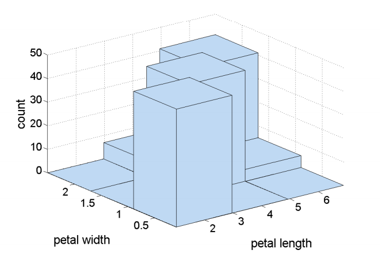

#### 条形图

条形图（Bar chart）显示带有矩形条的分类数据，其高度或长度与它们所代表的值成比例。它可以垂直或水平绘制。条形图显示了离散类别之间的比较。图表的一个轴表示要比较的特定类别，另一个轴表示其数量值。条形图还可以做成以多个为一组的聚类条形图，显示多个类别的数据值。相比直方图，条形图更简单，使用频率更高。

#### 散点图

最常见的是二维散点图，但也可以有三维散点图。散点图通常可以使用大小，形状和颜色来显示多种属性，从而紧凑地在图中总结几对属性的关系。

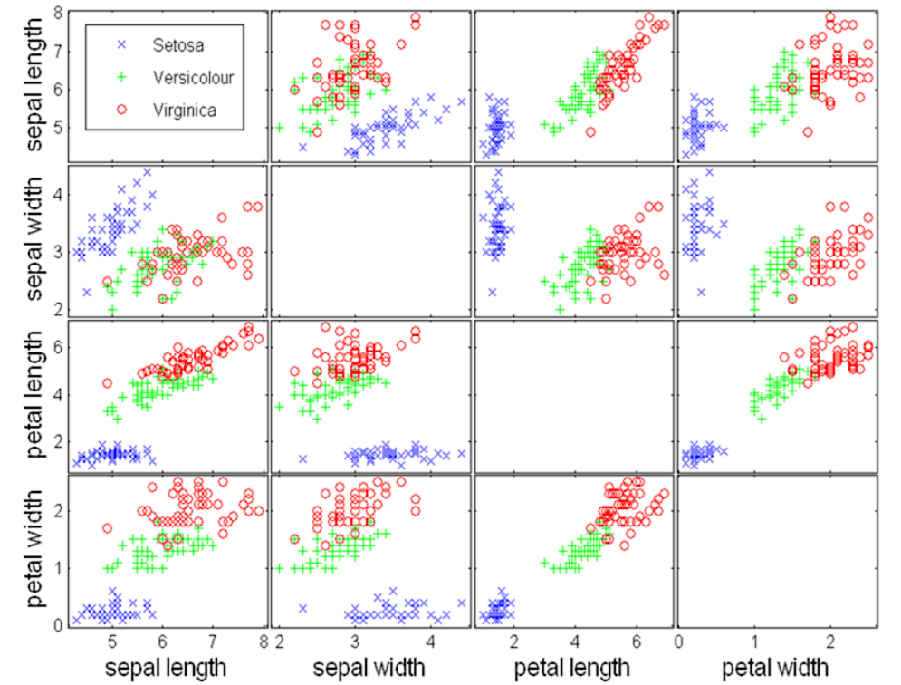

#### 箱图

箱图（Box plot）我们在数据预处理中做了介绍，这里我们再介绍一种箱图的变种——小提琴图（Violin plot）。

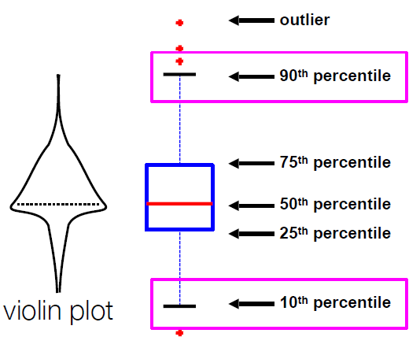

小提琴图结合了箱形图和密度图的特征。小提琴图作用与箱形图类似，箱线图展示了各分位数的位置，小提琴图除了包括数据中位数和表示四分位数范围的框，还显示了任意位置的密度，通过小提琴图可以知道哪些位置的密度较高。小提琴图比普通的箱图更具信息性。实际上，小提琴图显示了数据的完整分布。当数据分布是多峰值时，这种差异特别有用。在这种情况下，小提琴图清楚地显示了不同峰值的存在，它们的位置和相对幅度。

虽然小提琴图比箱形图更具信息性，但它们不太受欢迎。不过在许多软件包的扩展中，我们都能找到对小提琴图的支持。Python当中，matplotlib库，Plotly库和Seaborn库都能方便地使用小提琴图。


#### 平行坐标图

平行坐标图用于绘制高维数据的属性值，每个属性一个坐标轴，平行坐标系不同的坐标轴是平行的，对象用线表示。对象每个属性值映射到该属性相关联的坐标轴上的点，然后将这些点连接起来形成代表该对象的线。在查看此类分组时，对属性进行排序非常重要。

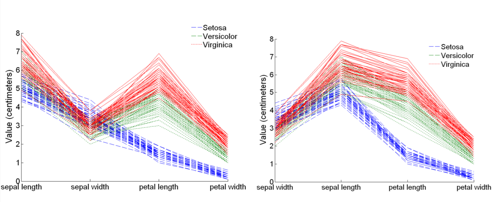

#### 相关矩阵图

相关矩阵图可以绘制数据矩阵。相关系数矩阵对于分析多元数据时非常有用，因为当变量较多时，我们很难从一堆庞大的数字中快速获取信息。正因为如此，相关系数矩阵的可视化应运而生。

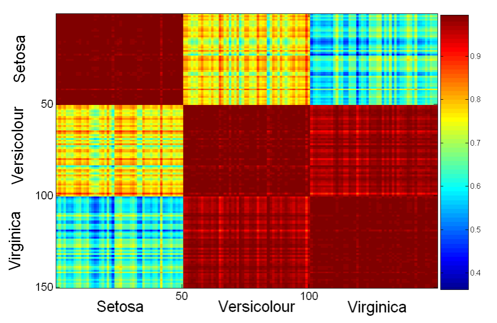

### 2.2.2 Python 可视化库介绍

目前在Python中，可视化库有很多，它们当中很多互相之间有些关联或借鉴，但也都有各自的特点。我们这里介绍三个较常用的可视化库：Matplotlib库，Seaborn库，Plotly库。

####  Matplotlib库

Matplotlib可以算的上是Python可视化库的泰斗,它是第一个Python的可视化程序库。经过十几年的发展，它仍然是Python使用者最常用的画图库，非常强大，也很复杂。Matplotlib 是数值数学扩展包 NumPy的可视化操作界面，它通过pyplot模块提供了一套和Matlab类似的绘图API，将众多绘图对象所构成的复杂结构隐藏在这套API内部。只需要调用pyplot模块所提供的函数就可以实现快速绘图以及设置图表的各种细节。它提供了许多Matlab的绘图函数，可以绘制多种图形：线图，直方图，饼图，散点图以及误差线图等；可以比较方便的定制图形的各种属性比如图线的类型，颜色，粗细，字体的大小等。Matplotlib.pyplot的简称常用作plt。

Matplotlib 是开源的，官方网站是：https://matplotlib.org/ ，网站上有很多优质的代码范例，以及各种参数的设置。这里我们还是根据Iris数据集展示一下Matplotlib的绘图结果。


```python
import matplotlib.pyplot as plt
from sklearn.datasets import load_iris
import pandas as pd

df=load_iris()
df_iris=pd.DataFrame(df['data'],columns=['sepal_length', 'sepal_width', 'petal_length', 'petal_width'])
df_iris['species']=df['target']
```


```python
setosa = df_iris[df_iris.species == 0]
# bins指定柱状图的个数
# range指定X轴的取值范围

columns1=['sepal_length', 'sepal_width', 'petal_length', 'petal_width']
fig, axs = plt.subplots(figsize=(10,7))
for i in columns1:
    axs.hist(setosa[i],bins=10)
plt.legend(columns1,fontsize=20)
plt.title("setosa in iris")
plt.xlabel("CM")
plt.show()
```


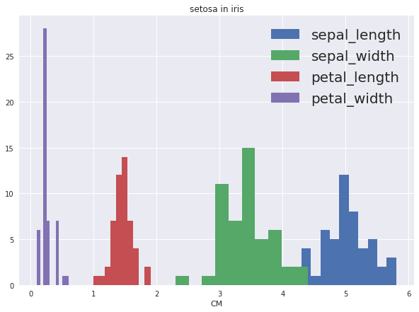


#### Seaborn库

Seaborn库在matplotlib的基础上进行了更高级的API封装，能够更容易地作图。我们也可以使用seaborn就能做出更生动好看的图，因此我们将Seaborn视为对matplotlib的补充。同时它也能高度兼容numpy与pandas数据结构以及scipy与statsmodels等统计模式。Seaborn的简称常用作sns。

Seaborn同样是开源的，官方网站是：https://seaborn.pydata.org/ ，网站上也有一些绘图的代码范例。下面让我们来看看Seaborn绘制出来的图是什么样子的。


```python
import seaborn as sns
sns.set(style="ticks")

df = sns.load_dataset("iris")
sns.boxplot(x="species", y="petal_length", data=df)
```


    <matplotlib.axes._subplots.AxesSubplot at 0x7fa902a0f748>


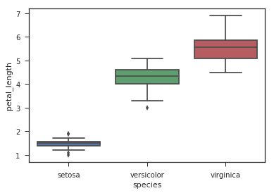


```python
sns.pairplot(df, hue="species",size=2)
```


    <seaborn.axisgrid.PairGrid at 0x7fa9035b2f98>


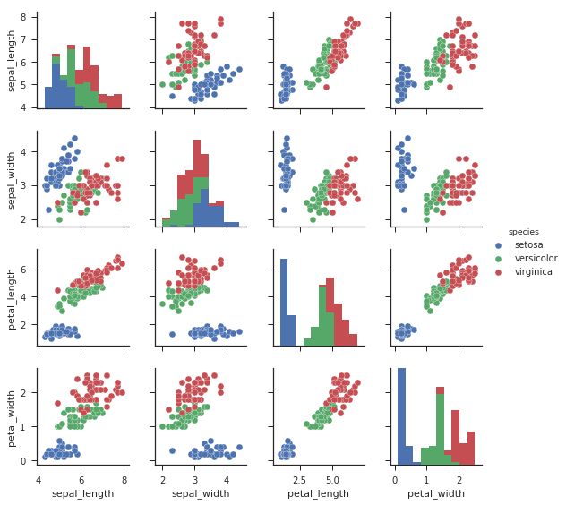


#### Plotly库

Plotly作为新一代互动型Python量化绘图库，目前可以称得上是作图的理想选择。原本plotly是收费的商业软件，幸运的是，2016年6月，plotly绘图模块库提供了免费的社区版本，并新增了python等多种编程语言的接口，以及离线（offline）模式支持。它作为一款开源的绘图库，可以应用于Python、R、MATLAB、Excel、JavaScript和jupyter等多种语言，主要使用的js进行图形绘制，实现过程中主要就是调用plotly的函数接口，底层实现完全被隐藏，便于初学者学习掌握。Plotly绘图即有matplotlib绘图模块的强大与灵活，也有Seaborn统计绘图的生动与优雅。

### 2.2.3 可视化举例

这里我们将继续使用2.1数据汇总中的泰坦尼克数据集作为可视化的举例。

我们之前已经知道这个数据集有缺失数据了，所以首先要做相应的处理来使得数据能够被有效的展现出来。这里我们将选择有意义的数据，我们不关注泰坦尼克号乘客的ID号和船票号，姓名与我们要做的分析也没有关联。由于我们有了Pclass这一属性，并且Cabin当中缺失数据过多，所以将删掉具体的舱位号这一列。然后进行填补缺失数据及分组，离散化等处理来达到作图建造模型的标准。


```python
for col in ['PassengerId','Name','Ticket','Cabin']:
    if col in df:
        del df[col]

df_grouped = df.groupby(by=['Pclass','SibSp'])#按Pclass对SibSp分组
```


```python
func = lambda grp: grp.fillna(grp.median())
df_imputed = df_grouped.transform(func)

col_deleted = list( set(df.columns) - set(df_imputed.columns))
df_imputed[col_deleted] = df[col_deleted]

print (df_imputed.info())

```

    <class 'pandas.core.frame.DataFrame'>
    RangeIndex: 891 entries, 0 to 890
    Data columns (total 8 columns):
    Survived    891 non-null int64
    Age         884 non-null float64
    Parch       891 non-null int64
    Fare        891 non-null float64
    SibSp       891 non-null int64
    Embarked    889 non-null object
    Sex         891 non-null object
    Pclass      891 non-null int64
    dtypes: float64(2), int64(4), object(2)
    memory usage: 55.8+ KB
    None


```python
df_imputed.dropna(inplace=True) #删除仍然存在缺少值的行
df_imputed = df_imputed[['Survived','Age','Sex','Parch','SibSp','Pclass','Fare','Embarked']]

print (df_imputed.info())
```

    <class 'pandas.core.frame.DataFrame'>
    Int64Index: 882 entries, 0 to 890
    Data columns (total 8 columns):
    Survived    882 non-null int64
    Age         882 non-null float64
    Sex         882 non-null object
    Parch       882 non-null int64
    SibSp       882 non-null int64
    Pclass      882 non-null int64
    Fare        882 non-null float64
    Embarked    882 non-null object
    dtypes: float64(2), int64(4), object(2)
    memory usage: 62.0+ KB
    None


```python
# 离散化年龄属性
df_imputed['Age_range'] = pd.cut(df_imputed['Age'],[0,18,30,60,1e4],
                                 labels=['children','young people','middle-aged people','old people'])
df_imputed.Age_range.describe()
```


    count              882
    unique               4
    top       young people
    freq               406
    Name: Age_range, dtype: object


```python
# 按Pclass对Age_range分组
df_grouped = df_imputed.groupby(by=['Pclass','Age_range'])
print ("每组幸存者的百分比：\n")
print (df_grouped.Survived.sum() / df_grouped.Survived.count())
```

    每组幸存者的百分比：
    
    Pclass  Age_range         
    1       children              0.875000
            young people          0.711111
            middle-aged people    0.614286
            old people            0.153846
    2       children              0.793103
            young people          0.410256
            middle-aged people    0.418919
            old people            0.333333
    3       children              0.336735
            young people          0.247350
            middle-aged people    0.153061
            old people            0.200000
    Name: Survived, dtype: float64


至此我们的数据清洗和预处理就完成了，一共剩有882组数据，下面将通过使用处理好的数据绘图。


```python
import matplotlib
import matplotlib.pyplot as plt
```


```python
df_grouped = df_imputed.groupby(by=['Pclass','Age_range'])
survival_rate = df_grouped.Survived.sum() / df_grouped.Survived.count()
fig = survival_rate.plot(kind='barh')

plt.show()
```


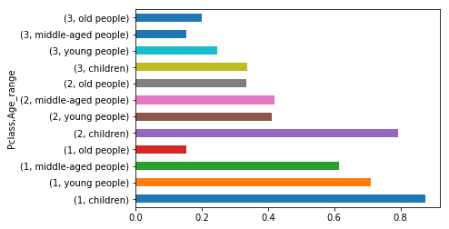


上图是按船舱级别和年龄范围划分的生存百分比图，我们可以清楚的看到一二级别的儿童获救比例最高，整体第一级别的乘客获救率最高。


```python
survival = pd.crosstab([df_imputed['Pclass'],
                        df_imputed['Age_range']],
                       df_imputed.Survived.astype(bool))
print(survival)

survival.plot(kind='bar', stacked=True)
```

    Survived                   False  True 
    Pclass Age_range                       
    1      children                2     14
           young people           13     32
           middle-aged people     54     86
           old people             11      2
    2      children                6     23
           young people           46     32
           middle-aged people     43     31
           old people              2      1
    3      children               65     33
           young people          213     70
           middle-aged people     83     15
           old people              4      1


    <matplotlib.axes._subplots.AxesSubplot at 0x7fa91a6af1d0>


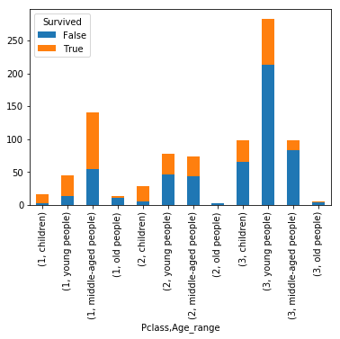


上图是各个船舱级别年龄段获救数量的对比图，在存在各分类比例悬殊的情况时，数量的对比要优于比率的值。我们还可以将该图进行归一化处理得到下图。


```python
survival_rate = survival.div(survival.sum(axis=1).astype(float),
                             axis=0)

survival_rate.plot(kind='barh',stacked=True)
```


    <matplotlib.axes._subplots.AxesSubplot at 0x7fa91a883128>


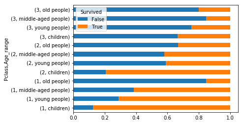


```python
fig = df_imputed.boxplot(column='Age', by = 'Pclass')
```


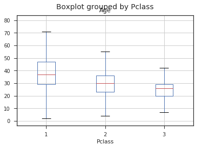


上图是各船舱级别乘客与船票价格的箱图。

接下来用Seaborn绘制这个数据集的几种图。


```python
import seaborn as sns

print('Seaborn:', sns. __version__)
```

    Seaborn: 0.8.1


```python
fig, ax = plt.subplots(figsize=(6, 6))

sns.violinplot(x="Pclass", y="Age", hue="Survived", data=df_imputed, 
               split=True, inner="quart")
```


    <matplotlib.axes._subplots.AxesSubplot at 0x7fa919cc2f28>


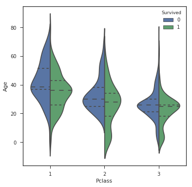


```python
sns.pairplot(df_imputed,hue="Survived")
```


    <seaborn.axisgrid.PairGrid at 0x7fa8ffb99278>


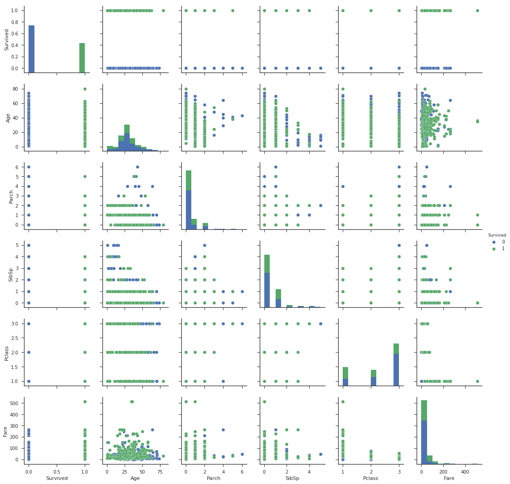


```python
df_imputed_jitter = df_imputed.copy()
df_imputed_jitter[['Parch','SibSp','Pclass']] += np.random.rand(len(df_imputed_jitter),3)/2
sns.pairplot(df_imputed_jitter, hue="Survived", size=2)
```


    <seaborn.axisgrid.PairGrid at 0x7fa8ff6a19b0>


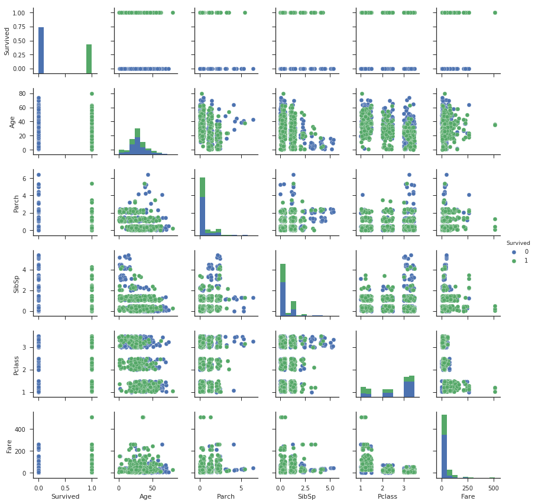


上图是两两组合多个特征做出的多个对比图，可以发现加了微小抖动后的图显示效果更好。


```python
fig, ax = plt.subplots(figsize=(6, 6))

sns.heatmap(df_imputed.corr(), cmap=cmap, annot=True)

fig.tight_layout()
```


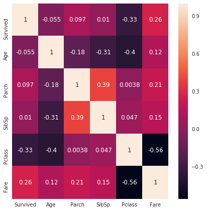


上图是相关矩阵图，我们可以在图中看两两之间的相关关系，颜色越浅代表正相关性越高，颜色越深代表负相关度越高。

至此我们基本已经将常用的绘图形式与方法进行了介绍与举例。关于数据可视化这一部分更加深入或拓展的部分在机器学习中不会涉及到太多，如果想了解更多的内容，可以翻阅数据挖掘，商业分析等相关的书籍，其中可能会有涉及更多的绘图方式。
