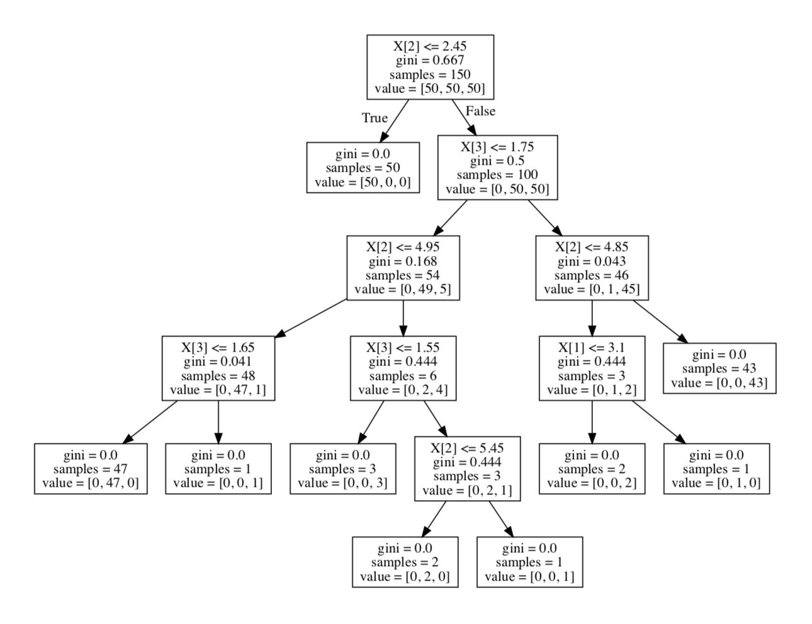

# 6.3支持向量机

## 6.3.1模型简介
​        支持向量机，英文名称是support vector machine，人们在提及时使用的称呼常用SVM。原始的SVM算法是由由弗拉基米尔·万普尼克和亚历克塞·泽范兰杰斯于1963年提出的，直至1992年，Bernhard E. Boser、Isabelle M. Guyon和弗拉基米尔·万普尼克提出将核技巧应用于此，使得支持向量机模型应用更广，而当前标准的前身（软间隔）是由Corinna Cortes和Vapnik于1993年提出的。

​	总的来说，支持向量机是一种有监督的二分类模型，如果要使用支持向量机做多类分类，需要利用多次二分类来实现。支持向量机的基本模型是将数据映射到多维空间中以点的形式存在，然后在特征空间上找到最佳的分离超平面使得训练集上正负样本间隔最大，学习策略就是间隔最大化，分类问题最终可转化为一个凸二次规划问题的求解。并且在引入核方法之后，支持向量机还可以用于解决非线性问题。

​        支持向量机模型的优点在于：

- 可以解决小样本的机器学习问题
- 相对于神经网络等算法没有局部极小值问题
- 可以处理高维数据集且效果较好
- 可以解决非线性问题
- 泛化能力强

​        支持向量机模型的缺点在于：

- 对缺失数据敏感

- 对于参数调节以及核函数的参数敏感

- 对于核函数的高纬映射解释能力不足

- 主要的应用领域在于文本分类、图像识别以及主要的二分类领域。

  支持向量机常被用于以下情景：

- 文本和超文本的分类，在归纳和直推方法中都可以明显减少所需要的有类标的样本数。

- 图像分类，有实验表明，在三四轮相关反馈之后支持向量机的搜索准确度明显高于其他传统的查询优化方案。

- 手写字体识别

- 医学中应用于蛋白质分类，有实验表明化合物的分类正确率高达90%以上，在生物科学中具有重大意义。

## 6.3.2SVM相关概念原理介绍

​	上述描述中，有两个不太熟悉的概念，一个是支持向量，听起来比较数学向的名称，一个是间隔，下面我们来介绍这两个概念。

​	在给定的训练样本集的情况下，我们想要把两种样本区分开，最容易想到也是最简单的方法就是在训练集的样本空间中找到一个划分超平面，能够将两种样本分隔开，但是能够达到这样效果的划分超平面不止一个甚至有非常多，有一些划分超平面虽然现在符合要求，但在样本集增加的情况下效果会变差，因此我们要做的就是寻找最优效果最好的那个划分超平面。

​	直观来看，当然是位于两类样本集“正中间”的划分超平面是最合适的，这个划分超平面即能够把两种样本分隔开，又使得两种样本最靠近它的点距离直线最大。而更靠近某一边的划分超平面对该边样本的变化反应会比较大，容易出现错误，“正中间”的划分超平面对训练样本局部变化的抗干扰能力更强。也就是说，“正中间”的划分超平面所产生的分类结果鲁棒性最佳对未出现过的数据泛化能力最强。

​	在样本空间中，设  点测试集：，其中  是 1 或者 −1，表明点  所属的类， 中每个都是一个 维实向量。划分超平面可以用如下所示的线性方程来描述：


其中 是该法向量。参数 决定从原点沿法向量 到超平面的偏移量。

​	如果这些样本数据是线性可分的，就可以选择两个平行超平面来分离正负数据集，使正负数据集的距离尽可能的大，这两个超平面可以由以下方程组表示：或是这两个超平面之间的区域就被称为“**间隔**”，划分超平面即为位于这两个平面正中间的超平面。通过几何可得两个超平面之间的距离为，因此为让两个超平面之间的距离最大，我们需要将 最小化，同时我们需要一些约束条件来使每个样本数据都位于间隔的正确一侧，即

 若

 或

 若

​	由上述描述可知，划分超平面其实是由最靠近它的那些 确定的，而这些  就叫做“**支持向量**”。

## 6.3.3核函数方法

​        以上针对的是线性可分的情况下，如果遇到线性不可分的情况应该怎么办呢？幸运的是，如果原始空间是有限维的，即属性数有限，那么就一定存在一个高维空间能够使样本可分。

​	而引出这种方法前要先介绍一下核函数，核函数早在1964年的时候就被Aizermann等在势函数方法的研究中引入到机器学习领域中，但是直到1992年的时候才被Vapnik等成功应用到将线性SVMs推广到非线性SVMs，从此核函数的潜力才得以充分挖掘，核函数的主要作用是将数据从低维空间映射到高维空间。

​	首先来看定义：支持向量机通过某非线性变换 φ( x) ，将输入空间映射到高维特征空间。特征空间的维数可能非常高。如果支持向量机的求解只用到内积运算，而在低维输入空间又存在某个函数 K(x, x′) ，它恰好等于在高维空间中这个内积，即K( x, x′) =<φ( x) ⋅φ( x′) > 。那么支持向量机就不用计算复杂的非线性变换，而由这个函数 K(x, x′) 直接得到非线性变换的内积，使大大简化了计算。这样的函数 K(x, x′) 称为核函数。

​	核函数将原始数据的维度变换，使得原样本空间线性不可分的样本点在变维之后的空间线性可分，这样可以很好的解决数据的非线性问题，而无需考虑映射过程。具体了解此过程凸优化理论知识，支持向量机即是在用对偶理论来求解一个二次凸优化问题，其中的对偶问题如下：


求的的最终结果是：


以上是线性可分的情况，在线性不可分的情况下就需要先扩维再计算，计算的形式是一样的：


其中表示的就是样本空间扩维以后的坐标。

​	从上述式子可以看出，无论是原始的样本空间还是扩维后的样本空间，在求解对偶问题时都需要各样本点的内积的结果。简单情况下只需将二维空间扩展到三维，但实际问题中往往需要扩到更高维的空间甚至是无穷维的空间才可以，这时候就涉及到计算内积的复杂度变高的问题，因此我们提出了核函数的概念。

​	通俗的理解核函数即为能使任意两个样本点在扩维以后的样本空间内的内积，和这两个样本在原来空间经过一个函数后的输出结果相同的函数。

​	核函数的确定并不困难,满足Mercer定理的函数都可以作为核函数。常用的核函数有：线性核函数，Sigmoid核函数和复合核函数，多项式核函数，傅立叶级数核，径向基核函数，B 样条核函数和张量积核函数等。

​	核函数方法具有非常广泛的应用，具有以下一些特点：

- 核函数的引入可以避免维数过高产生过高的计算量，而且输入空间的维数对核函数矩阵没有影响，因此核函数可以非常有效地处理高维输入；
- 不需要知道非线性变换函数Φ的形式和参数；
- 核函数的形式和参数的变化会对特征空间的性质产生影响，因此会产生不同核函数的性能变化；
- 核函数还可以与其他不同算法相结合，形成多种不同的基于核函数技术的方法，而且这两部分的设计可以分开进行，因此可以针对不同的应用选择不同的核函数和算法以达到最好的效果。

	​	

## 6.3.4实例演示

**线性可分演示：**

```python
输入：

from sklearn import svm

X = [[1, 0], [0, 1], [2, 2]]

y = [0, 0, 1]

clf = svm.SVC(kernel = 'linear')

clf.fit(X, y)

print('clf：',clf)
```

```python
结果：

clf： SVC(C=1.0, cache_size=200, class_weight=None, coef0=0.0, decision_function_shape='ovr', degree=3, gamma='auto', kernel='linear',max_iter=-1, probability=False, random_state=None, shrinking=True,tol=0.001, verbose=False)
```


参数解释：

（1）C: 目标函数的惩罚系数C，用来平衡分类间隔margin和错分样本的，default C = 1.0；
（2）kernel：参数选择有RBF, Linear, Poly, Sigmoid, 默认的是"RBF";
（3）degree：if you choose 'Poly' in param 2, this is effective, degree决定了多项式的最高次幂；
（4）gamma：核函数的系数('Poly', 'RBF' and 'Sigmoid'), 默认是gamma = 1 / n_features;
（5）coef0：核函数中的独立项，'RBF' and 'Poly'有效；
（6）probablity: 可能性估计是否使用(true or false)；
（7）shrinking：是否进行启发式；
（8）tol（default = 1e - 3）: svm结束标准的精度;
（9）cache_size: 制定训练所需要的内存（以MB为单位）；
（10）class_weight: 每个类所占据的权重，不同的类设置不同的惩罚参数C, 缺省的话自适应；
（11）verbose: 跟多线程有关，不大明白啥意思具体；
（12）max_iter: 最大迭代次数，default = 1， if max_iter = -1, no limited;
（13）decision_function_shape ： ‘ovo’ 一对一, ‘ovr’ 多对多  or None 无, default=None
（14）random_state ：用于概率估计的数据重排时的伪随机数生成器的种子。
 ps：7,8,9一般不考虑。

​	在拟合之后，这个模型就可以用来预测：

```python
print('clf.predict([[1, 0]])：',clf.predict([[1, 0]]))

clf.predict([[1, 0]])： [0]
```

​	SVMs决策函数取决于训练集的一些子集，被称作支持向量。这些支持向量的属性可以在support_vectors_ ，support_ 和 n_support中找到。

```python
#get support vectors

print('clf.support_vectors：',clf.support_vectors)

#get indices of support vectors

print('clf.support：',clf.support) 

#get number of support vectors for each class

print('clf.n_support：',clf.n_support) 

clf.support_vectors_： [[ 1.  0.]

 [ 0.  1.]

 [ 2.  2.]]

clf.support_： [0 1 2]

clf.n_support_： [2 1]

clf.predict([[1, 0]])： [0]
```

**多分类演示**

​	SVC和NuSVC为多分类实现了“one-against-one”，即“一对一”的方法，如果n_class代表类别的数目，则将重构n_class*(n_class-1) /2 个分类器，且每一个将从两个类别中训练数据。

```python
输入：

from sklearn.svm import SVC,LinearSVC

X=[[0],[1],[2],[3]]

Y = [0,1,2,3]

clf = SVC(decision_function_shape='ovo') #ovo为一对一

clf.fit(X,Y)

print ("SVC:",clf.fit(X,Y))

dec = clf.decision_function([[1]])    #返回的是样本距离超平面的距离

print ("SVC:",dec)

print('dec.shape[1]:',dec.shape[1])#4*3=6分类器数目应为6
```

```python
结果：

SVC: SVC(C=1.0, cache_size=200, class_weight=None, coef0=0.0, decision_function_shape='ovo', degree=3, gamma='auto', kernel='rbf', max_iter=-1, probability=False, random_state=None, shrinking=True, tol=0.001, verbose=False)

SVC: [[-0.63212056  0.          0.3495638   0.63212056  0.98168436  0.3495638 ]]

dec.shape[1]: 6
```

​	另一方面，LinearSVC为多分类分类器实现了“one-vs-the-rest”，即“一对其他”的方法，这种方法只需要训练n_class个模型，如果是分两类，那么只需要训练一个模型。

```python
输入：

from sklearn.svm import SVC,LinearSVC

X=[[0],[1],[2],[3]]

Y = [0,1,2,3]

clf = SVC(decision_function_shape='ovr') #ovr是一对其他

clf.fit(X,Y)

print ("SVC:",clf.fit(X,Y))

dec = clf.decision_function([[1]])    #返回的是样本距离超平面的距离

print ("SVC:",dec)

print('dec.shape[1]:',dec.shape[1])#分类器数目应为4
```

```python
结果：

SVC: SVC(C=1.0, cache_size=200, class_weight=None, coef0=0.0, decision_function_shape='ovr', degree=3, gamma='auto', kernel='rbf', max_iter=-1, probability=False, random_state=None, shrinking=True, tol=0.001, verbose=False)

SVC: [[ 1.9370957   3.5         0.9370957  -0.37419139]]

dec.shape[1]: 4
```


**线性不可分演示**

​	下面我们将使用sklearn自带的人脸图片数据集做线性不可分的实例演示。首先，由于图片数据集中的特征值较多，我们需要先进行降维步骤，所以这里还用到了PCA降维方法。

```python
输入：

#coding:utf8

import logging

from sklearn.cross_validation import train_test_split

from sklearn.datasets import fetch_lfw_people

from sklearn.grid_search import GridSearchCV

from sklearn.metrics import classification_report

from sklearn.metrics import confusion_matrix

from sklearn.decomposition import RandomizedPCA

from sklearn.svm import SVC

from time import time
```

```
解释：

train_test_split 将数据集划分为训练集和测试集

fetch_lfw_people 本实例应用的sklearn自带的人脸数据集

GridSearchCV 寻找合适的SVM参数组合

classfusion_report和confusion_matrix 给模型打分

RandomizedPCA 降维方法
```

```python
输入：

#打印日志信息

logging.basicConfig(level=logging.INFO, format='%(asctime)s%(message)s')

lfw_people = fetch_lfw_people(min_faces_per_person=70, resize=0.4)

n_samples, h, w = lfw_people.images.shape  #实例数(图片数)、h、w

X = lfw_people.data 

n_features = X.shape[1] #特征向量的维度1850

Y = lfw_people.target   #对应的人脸标记

target_names = lfw_people.target_names

n_classes = target_names.shape[0] #需要识别的数目

X_train,X_test,y_train,y_test = train_test_split(X, Y, test_size=0.3)#分割训练集和测试集
```

```
解释：

第一次运行该程序时，在运行到lfw_people = fetch_lfw_people(min_faces_per_person=70, resize=0.4)一行时，电脑中如果不含所用的人脸数据集，程序会自行去网上下载，数据集大小在200M左右，下载完成以后之后不会再重复下载

数据集划分时我们选择将0.75的数据集划分成了训练集，0.25的数据集划分成训练集
```

```python
输入：

n_components= 150   #降维参数，组成元素的数量，即保留下来的特征个数

pca = RandomizedPCA(n_components=n_components,whiten=True).fit(X_train)

print (pca)

X_train_pca = pca.transform(X_train)

X_test_pca = pca.transform(X_test)

print (X_train_pca.shape)

print (X_test_pca.shape)

#C 是对错误部分的惩罚；gamma 合成点

param_grid = {'C': [1e3, 5e3, 1e4, 5e4, 1e5],
              'gamma': [0.0001, 0.0005, 0.001, 0.005,0.01, 0.1],}

#rbf处理图像较好

clf = GridSearchCV(SVC(kernel='rbf', class_weight='balanced'), param_grid)

print (clf)

clf = clf.fit(X_train_pca, y_train)

print (clf.best_estimator_ )  
```

```
解释：

降维主要有两个步骤：首先是使用无监督学习训练PCA模型，然后利用建好的PCA模型对数据进行降维，这里使用的是随机降维

在建立SVM模型时，我们有两个参数需要填写，即C参数和gamma参数，我们这里给出了几个数值选择使用GridSearchCV进行组合以确定最终合适的组合
```

```python
输入：

y_pred = clf.predict(X_test_pca)

print (classification_report(y_test,y_pred,target_names=target_names))#打印预测成绩报告

print (confusion_matrix(y_test,y_pred,labels=range(n_classes)))#打印预测成绩混淆矩阵

print ('y_test:',y_test)

print ('y_pred:',y_pred)
```

```python
结果：

RandomizedPCA(copy=True, iterated_power=2, n_components=150,
       random_state=None, whiten=True)

(851, 150)

(366, 150)

GridSearchCV(cv=None, error_score='raise',
       estimator=SVC(C=1.0, cache_size=200, class_weight='balanced', coef0=0.0,
  decision_function_shape='ovr', degree=3, gamma='auto', kernel='rbf',
  max_iter=-1, probability=False, random_state=None, shrinking=True,
  tol=0.001, verbose=False),
       fit_params={}, iid=True, n_jobs=1,
       param_grid={'C': [1000.0, 5000.0, 10000.0, 50000.0, 100000.0], 'gamma': [0.0001, 0.0005, 0.001, 0.005, 0.01, 0.1]},
       pre_dispatch='2*n_jobs', refit=True, scoring=None, verbose=0)

SVC(C=1000.0, cache_size=200, class_weight='balanced', coef0=0.0, decision_function_shape='ovr', degree=3, gamma=0.001, kernel='rbf', max_iter=-1, probability=False, random_state=None, shrinking=True, tol=0.001, verbose=False)
                   precision    recall  f1-score   support

     Ariel Sharon       0.75      0.78      0.77        23
     Colin Powell       0.84      0.87      0.86        78
  Donald Rumsfeld       0.76      0.72      0.74        36
    George W Bush       0.88      0.91      0.89       159
Gerhard Schroeder       0.85      0.72      0.78        32
       Tony Blair       0.78      0.74      0.76        38

      avg / total       0.84      0.84      0.84       366

[[ 18   1   1   1   1   1]
 [  1  68   2   6   0   1]
 [  4   2  26   4   0   0]
 [  1   7   5 144   0   2]
 [  0   1   0   4  23   4]
 [  0   2   0   5   3  28]]

y_test: [1 1 3 1 3 3 5 3 3 3 3 2 3 5 2 3 3 2 1 1 3 4 2 3 3 1 3 5 3 4 4 1 3 1 1 2 2
 5 5 3 1 4 2 3 4 3 3 3 3 1 4 0 3 0 3 3 3 3 3 5 1 3 1 1 5 4 3 3 1 3 3 3 1 5
 3 0 1 2 4 3 5 5 5 0 4 1 3 1 3 0 1 1 3 3 3 1 3 1 3 3 1 3 3 0 4 1 3 3 4 2 3
 1 4 3 3 2 4 2 3 4 3 2 1 3 3 3 3 4 3 3 3 3 5 1 3 0 3 2 3 3 1 1 2 1 2 3 1 3
 3 3 5 0 1 4 1 3 3 1 1 3 3 2 4 3 3 0 1 1 2 4 5 3 1 1 1 5 0 3 1 3 3 3 2 2 3
 3 3 3 5 5 3 3 3 3 3 2 4 1 5 2 3 3 3 3 1 3 4 5 4 5 1 2 1 2 0 3 3 2 3 5 3 5
 3 3 1 5 4 0 0 3 4 1 1 4 3 1 3 3 3 3 1 1 3 1 2 4 1 5 3 1 2 5 2 0 3 1 2 0 3
 2 1 3 1 3 0 1 3 3 1 2 3 4 3 3 3 4 3 3 3 4 1 5 2 5 0 1 2 1 2 3 3 3 3 3 1 5
 2 0 3 1 3 3 3 1 1 1 3 0 3 3 5 3 3 1 5 3 3 3 3 1 3 4 3 3 1 3 4 1 0 3 3 3 5
 3 1 0 5 1 3 0 3 5 2 5 3 3 3 2 1 1 5 0 4 3 5 1 3 3 3 5 3 4 5 3 1 3]

y_pred: [1 1 3 1 3 3 3 3 3 1 3 2 3 5 2 3 3 2 1 1 3 5 3 3 3 1 3 4 3 4 3 5 3 1 1 2 2
 5 5 3 1 4 3 3 4 3 3 3 3 3 4 2 3 0 3 3 3 3 3 5 1 3 1 1 1 4 1 3 3 3 3 3 1 5
 3 0 1 2 4 3 5 5 5 0 4 1 3 1 3 0 1 1 3 5 3 1 3 1 3 3 1 3 2 0 4 2 3 3 5 3 3
 1 4 3 3 2 3 2 3 3 2 2 1 3 3 3 3 5 3 3 5 3 3 1 3 0 3 2 3 3 1 3 2 1 1 3 1 3
 3 3 3 0 1 4 3 3 3 1 1 3 3 2 4 3 3 3 1 1 2 4 5 3 1 1 1 3 0 3 3 3 3 3 2 3 3
 3 3 3 5 5 3 3 1 3 3 0 4 1 1 0 3 3 3 3 1 3 5 4 4 5 1 2 1 2 0 3 3 1 3 5 3 5
 3 3 1 4 4 0 4 3 1 1 1 4 3 1 3 3 3 3 1 1 3 1 2 3 1 5 3 1 2 5 0 5 3 1 2 0 3
 2 0 3 1 3 0 2 3 3 1 2 3 4 3 3 3 4 3 2 1 4 1 5 2 5 0 1 2 1 2 2 3 3 3 3 1 5
 0 0 3 1 3 3 3 1 1 1 3 0 1 3 5 3 3 1 5 3 3 3 3 1 3 4 3 3 1 0 4 1 1 3 3 3 5
 3 3 0 5 1 3 0 3 5 2 5 3 1 3 2 1 1 5 0 4 3 5 1 3 3 2 3 3 4 5 3 1 1]
```

```
解释：

precision是预测的准确率，recall是召回率，而f1-score是兼顾前两者结果的评估指标，他们的结果越大说明预测的结果效果越好

confusion_matrix的矩阵中，位于对角线位置的是该人预测正确的个数，而对角线以外的数值是预测错误的个数，由我们得出的结果可知，第一行有18个预测争取，有5个预测错误

从我们得出的结果可以看出SVM的预测效果不错，自己动手试一试是不是这样的吧？
```

## 6.3.5本章小结

​	支持向量机，	一种有监督的二分类模型，如果要使用支持向量机做多类分类，需要利用多次二分类来实现。支持向量机的基本模型是将数据映射到多维空间中以点的形式存在，然后在特征空间上找到最佳的分离超平面使得训练集上正负样本间隔最大，学习策略就是间隔最大化，分类问题最终可转化为一个凸二次规划问题的求解。并且在引入核方法之后，支持向量机还可以用于解决非线性问题，核函数即为能使任意两个样本点在扩维以后的样本空间内的内积，和这两个样本在原来空间经过一个函数后的输出结果相同的函数。

​	由于数据映射的处理方法，因此对于高维数据处理效果很好，被广泛应用于图像和文字处理等方面。

​        

# 6.4决策树

## 6.4.1模型简介
​        决策树模型是基于树理论实现的数据分类，很像数据结构中的B+树，是一种基本的分类和回归方法。决策树算法是最早的机器学习算法之一，早在1966年Hunt,Marin 和 Stone 提出的CLS 学习系统中就给出了决策树算法的概念，但直至1979年，ID3算法的原型才被人提出，后来在1983和1986年 J.R. Quinlan对ID3算法进行了总结和简化才正式确立了决策树模型。

​	决策树的模型是一颗树的形状结构，可以是二叉树也可以是多叉树。决策树中每个非结点表示一个特征属性上的测试，每个分支代表这个特征属性在某个值域上的输出，而每个叶结点存放一个类标签。使用决策树进行决策的过程就是从根结点开始，测试待分类项中相应的特征属性，并按照其值选择输出有向边，直到到达叶结点，也就是将实例分到叶结点的类中。决策树模型可以理解为对象属性和对象值之间的一种映射关系，学习得到的决策树既可以看作是多个 if-then 的规则，也可以看作是定义在特征空间与类空间上的条件概率分布。它对于噪声数据有很好的鲁棒性，并且能够从训练集中学习析取表达式。

​	在机器学习中，决策树主要有两种类型：分类树和回归树。分类树的结果输出是样本的类别，而回归树的结果输出是一个实数，例如房子的价格，病人得病的概率。有些集成的方法利用多棵树来进行预测，例如袋装算法（Bagging），是有放回的抽样法来训练多棵决策树，最后利用投票法得出结果输出；随即森林（Random Forest），是使用多棵决策树来改进分类性能等等。

​        决策树模型具有如下优点：

- 模型结构清晰，容易理解方便展示，并且可以提取出规则用作可视化分析；
- 标称型（有限的数据中取，如：是、否）和数值型（无限的具体的数据中取，如：1.23、4.56等）的数据可以同时处理；
- 对中间值缺失不敏感；
- 模型可以扩展到大型数据库中，且它的大小独立于数据库的大小。

​       决策树模型具有如下缺点：

- 容易出现过拟合的问题；
- 容易忽略数据本身属性之间的关联关系；
- ID3算法在计算信息增益时结果容易偏向数值比较多的特征。

​        决策树模型由于具有良好的分析能力、解释性等优点常被应用于企业管理实践，企业投资决策等决策应用中。

​	决策树的核心是树枝的分裂，到底该选择什么来决定树的分叉是决策树构建的基础，因此我们下面一节来介绍与分枝有关的相关概念。

## 6.4.2决策树相关概念

​	最优的分叉特征怎么找这个问题其实就是决策树的一个核心问题了。我们常用的方法是更具信息增益或者信息增益率来寻找最优特征，信息增益听起来比较专业，我们该如何理解呢。

​	在这儿之前我们需要先介绍一下另外一个概念——熵。熵，简单地理解是我们做事情所付出的代价，在机器学习的情况下，指的是数据的不确定性，代价高即为不确定性高，而决策树算法的目的就是制定规则尽量降低数据的不确定性。要降低不确定性，需要找到数据集中有用的特征。在特征的限制下，我们又得到数据集新的不确定性，通常这个不确定性是下降的，因为具有条件约束，而下降越多就代表这个特征越有用，信息论中理解如下所示。

​	在信息论中，熵代表随机变量的不确定性，具体来看，有一个变量X，它有n种可能的取值，熵的定义为：


由定义可以看出熵的值与变量的取值无关，只与变量取值的概率有关。熵越大，随机变量的不确定性就越大。条件熵表示在一个条件下随机变量的不确定性，设有随机变量（x,y），定义X在给定条件y下的条件熵为：


​	当熵和条件熵中的随机变量的概率取值都是由数据估计得到时，对应的熵和条件熵 称为经验熵和经验条件熵。信息增益表示在一个条件下，信息不确定性减少的程度。例如特征A对训练数据集D的信息增益为g(D,A)，信息增益定义为集合D的经验熵H(D)与集合D在特征A的条件下的经验条件熵H(D|A)之差。特征A对训练数据集D的信息增益比g'(D|A)定义为其信息增益g(D|A)与训练数据集D关于特征A的值的熵H'(D)之比。基尼指数同熵一样也表示集合D的不确定性，基尼指数越大，样本集合的不确定性也就越大，假设有K个类，则基尼指数定义为：


## 6.4.3常用决策树算法

**ID3算法**

​        ID3 算法是一种贪心算法，起源于概念学习系统，最早是由罗斯昆在 1975 年提出的 一种分类预测方法，以信息熵作为标准来作为特征选择的准则。从信息论的知识我们可以了解到，一个系统越有序信息熵就越低，反之系统越乱就信息熵越高，期望信息越小， 信息增益就越大，从而纯度越高。所以 ID3 算法的核心思想就是以信息增益作为特征选取的度量，选择分裂后信息增益最大的属性进行分裂。 

​        方法具体实现:从根结点开始，对结点计算所有特征的信息增益，信息增益表示的是在得到特征的信息之后使类的信息的不确定性降低的程度，因此信息增益越大说明这个特征对于分类的区分度帮助就越大，所以选择这个特征作为结点的特征，把这个特征的不同取值建立成子结点;再对所有的子结点都递归的调用上述方法;直到所有特征的信息增益都很小或者没有特征可以选取的时候就结束。此时可以通过训练集得到一个初步完整的决策树。 

**C4.5算法**

​        C4.5 算法作为 ID3 算法的改进版是一种经典的决策树算法，目前被广泛应用于数据挖掘的领域中。它最早是在罗斯昆的书中提出的，其背景是 ID3 算法存在很多问题，罗斯昆通过研究发现了 ID3 算法问题的原因，提出了很多改进，包括以下几个方面: 

- 由于 ID3 在特征选择时容易选择取值较多的属性，为了解决这个问题 C4.5 算法 的特征选择准则由信息增益变成信息增益比。 
- 通过离散化弥补了 ID3 算法不能处理连续型数据的处理的问题。
- 可以处理取值不完整的数据。
- 并在树的构造过程中添加了剪枝的操作。

​        C4.5 算法决策树生成方法具体实现同 ID3 相似，只是在特征选择的时候将信息增益比作为准则。但这样产生的树对训练集中的数据分类很准确，对未知的测试数据分类不那么准确，会出现过拟合的现象。出现过拟合的原因在于学习时过多地是在考虑如何提高对训练集数据分类的正确性，并没有考虑到产生决策树的复杂程度，因此解决方法是降低决策树的复杂程度，对其进行剪枝。决策树的剪枝通常是利用极小化决策树整体的损失函数或代价函数来实现。 

**CART算法**

​       CART 算法即分类回归树算法，此算法中每个决策结点都是一个二叉选择结点，特征的取值为“是”或“否”，生成的决策树是一颗二叉决策树，二叉树的好处在于不容易产生数据碎片，比多叉树更加精确。 

​        算法建立决策树的步骤主要分为两步，第一步是建立分类回归树，通过对训练集中的数据进行二叉分类，逐步建立分类回归决策树。第二步时决策树的剪枝，通过测试数 据集对第一步生成的决策树进行剪枝。 

​	其中，建立决策树中最重要的一点是特征的选择准则。不同于 ID3、C4.5 算法用的都是熵来判别，CART 算法用的是基尼指数进行特征选择。但是基尼指数同样也表示了集合的不确定性，基尼指数越大，集合的不确定性也就越大，这一点是与熵的作用相类似的。另外，CART 算法第一步建立的决策树也存在对噪声数据的过拟合的现象，所以需要进行剪枝这一步骤进行处理。 

## 6.4.4决策树算法流程

**ID3算法流程**

输入:训练数据集 D，特征集 A，阈值; 

输出:决策树 T

A. 读取文件信息，统计数目

B. 建立决策树

- 对当前样本集合计算属性的信息增益

- 如果 D 中样本集为空，则生成一个信息数目都为 0 的树节点返回

- 如果 D 中样本均属于同一类，则生成单结点树返回，并将此类作为该结点的类标记

- 否则，选择信息增益最大的属性 Ai

- 如果 Ai 的信息增益小于阈值，则生成单结点树返回，并将 D 中实例数目最多的类作为该结点的类标记

- 否则，把在 Ai 处取值相同的样本归于同一子集，Ai 有几种取值就构建几个子集

  依次对每种取值情况下的子集递归调用建树算法，得到子树 Ti，返回 Ti 若子集中只含有单个属性，则分支为叶子结点，判断其属性值并标上相应的符号，然后返回调用处  

**C4.5算法流程**

输入:训练数据集 D，特征集 A，阈值; 

输出:决策树 T 

A.读取文件信息，统计数目

B. 建立决策树

- 如果 D 中样本集为空，则生成一个信息数目都为 0 的树节点返回
- 如果 D 中样本均属于同一类，则生成单结点树返回，并将此类作为该结点 的类标记
- 否则，选择信息增益率最大的属性 Ai
- 如果 Ai 的信息增益小于阈值，则生成单结点树返回，并将 D 中实例数目 最多的类作为该结点的类标记
- 否则，把在 Ai 处取值相同的样本归于同一子集，Ai 有几种取值就构建几 个子集
- 依次对每种取值情况下的子集递归调用建树算法，得到子树 Ti，返回 Ti 若子集中只含有单个属性，则分支为叶子结点，判断其属性值并标上相应 的符号，然后返回调用处 

C. 事后剪枝

D. 输出最优决策树 

**CART算法流程**

输入:训练数据集 D，停止计算的条件; 

输出:决策树 T 

A. 读取文件信息，统计数目 

B. 建立决策树 

​	根据训练数据集，从根结点开始，递归地对每个结点进行一下操作，构建二叉决策树:

- 对于每一个特征 A，每个可能的取值 a，根据样本点对 A=a 的测试是“是”还是“否”将 D 分割成 D1、D2 两部分，计算 A=a 时的基尼指数
- 在所有的特征 A 以及它们所有可能的切分点 a 中，选择基尼指数最小的特 征及其切分点作为最优特征和最优切分点。按照选取的最优特征和最优切分点从现结点生成两个子结点，将 D 按照特征分配到两个子结点中去
- 对两个子结点递归地调用上两步，直至满足停止计算的条件  生成决策树 T 

C. 事后剪枝输出最优决策树 

## 6.4.5实例演示

**简单二分类演示**

```python
输入：

from sklearn import tree

X = [[0, 0], [1, 1]]

Y = [0, 1]

clf = tree.DecisionTreeClassifier()

clf = clf.fit(X, Y)

print(clf.predict([[2, 2]]))#预测样本类别

print(clf.predict_proba([[2, 2]]))#预测每个类的概率
```

**多分类演示**

```python
输入：

import os

import sys

from sklearn.datasets import load_iris

from sklearn import tree

os.environ["PATH"] += os.pathsep + '/usr/local/Cellar/graphviz/2.40.1/bin'

iris = load_iris()

clf = tree.DecisionTreeClassifier()

clf = clf.fit(iris.data, iris.target)

with open("iris.dot", 'w') as f:

    f = tree.export_graphviz(clf, out_file=f)
```

```
解释：

决策树可视化环境搭建需要先安装GraphViz。下载地址在：http://www.graphviz.org/。如果你是linux系统，可以用apt-get或者yum的方法安装。如果你是windows系统，就在官网下载msi文件安装。如果你是Mac OS系统，装GraphViz只需在终端输入“brew install graphviz”即可。无论是linux，OS还是windows，装完后都要设置环境变量，将graphviz的bin目录加到PATH。例如是windows，将C:/Program Files (x86)/Graphviz2.38/bin/加入了PATH。例如是OS系统，终端下输入：export PATH="/usr/local/Cellar/graphviz/2.40.1/bin:$PATH" 其中的文件路径就是利用brew安装的文件路径。有时候即便设置环境变量也可能找不到GraphViz，因此需要在程序中加入GraphViz文件地址。
```

结果展示：



**回归问题演示**

```python
输入：

from sklearn import tree

X = [[0, 0], [2, 2]]

y = [0.5, 2.5]#只有在这种情况下，y数组的预期才是浮点值

clf = tree.DecisionTreeRegressor()

clf = clf.fit(X, y)

print(clf.predict([[1, 1]]))
```

```
结果：

[0.5]
```

## 6.4.6本章小结

​	决策树模型是基于树理论实现的数据分类，决策树的模型是一颗树的形状结构，可以是二叉树也可以是多叉树。决策树中每个非结点表示一个特征属性上的测试，每个分支代表这个特征属性在某个值域上的输出，而每个叶结点存放一个类标签。使用决策树进行决策的过程就是从根结点开始，测试待分类项中相应的特征属性，并按照其值选择输出有向边，直到到达叶结点，也就是将实例分到叶结点的类中。决策树模型可以理解为对象属性和对象值之间的一种映射关系，学习得到的决策树既可以看作是多个 if-then 的规则，也可以看作是定义在特征空间与类空间上的条件概率分布。它对于噪声数据有很好的鲁棒性，并且能够从训练集中学习析取表达式。

​	在机器学习中，决策树主要有两种类型：分类树和回归树。分类树的结果输出是样本的类别，而回归树的结果输出是一个实数，例如房子的价格，病人得病的概率。有些集成的方法利用多棵树来进行预测，例如袋装算法（Bagging），是有放回的抽样法来训练多棵决策树，最后利用投票法得出结果输出；随即森林（Random Forest），是使用多棵决策树来改进分类性能等等。

​	具有模型清晰容易理解展示等优点，被广泛应用于企业管理实践和企业投资决策等方面。


